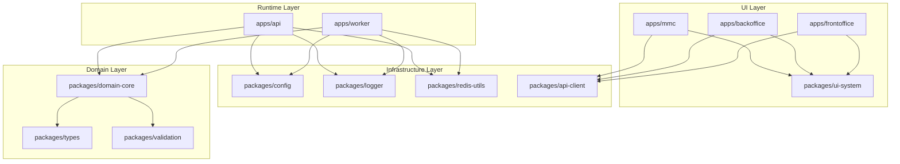

# Zidney

A production‑grade **B2B2C white‑label educational SaaS platform** designed for multi‑tenant exam
systems, learning platforms, and institutional deployments.

This repository is a **governed monorepo** built for **AI‑assisted development, strict architectural
boundaries, and scalable runtime services**.

---

## 30‑Second Developer Onboarding

If you just cloned the repository, follow these steps to get the platform running quickly.

1. Install dependencies

```
bun install
```

2. Start required infrastructure

```
docker-compose up -d
```

3. Run the backend API

```
cd apps/api
bun run dev
```

4. Start a frontend application (example: MMC)

```
cd apps/mmc
bun run dev
```

5. Verify architecture integrity

```
bun scripts/infra-audit.ts
```

If the audit passes, your environment is correctly configured.

---

## Quick Start (Developers)

### Developer Quick Commands

| Command            | Purpose                                                                                               |
| ------------------ | ----------------------------------------------------------------------------------------------------- |
| `bun repo:onboard` | First-time setup: checks Bun version, installs dependencies, activates Husky hooks, verifies services |
| `bun repo:doctor`  | Diagnose repository health: dependencies, workspace links, architecture, TypeScript                   |
| `bun repo:fix`     | Auto-repair common issues: re-install, regenerate architecture artifacts, prune unused packages       |
| `bun repo:status`  | Print a quick health summary (CI status, architecture, AI context, type safety)                       |

---

### Prerequisites

- Bun (stable 1.x)
- Docker
- Docker Compose
- Node compatible environment

Verify installations:

```
bun --version
docker --version
```

---

### Installation

Clone the repository:

```
git clone <repo-url>
cd zidney
```

Install dependencies:

```
bun install
```

Start infrastructure services:

```
docker-compose up -d
```

This will start required services such as:

- PostgreSQL
- Redis
- supporting infrastructure

---

## Running the Platform

### Backend API

```
cd apps/api
bun run dev
```

### Worker

```
cd apps/worker
bun run dev
```

### Frontend Applications

MMC (Master Management Console)

```
cd apps/mmc
bun run dev
```

Backoffice

```
cd apps/backoffice
bun run dev
```

Frontoffice

```
cd apps/frontoffice
bun run dev
```

---

## Repository Structure

Zidney follows a **layered monorepo architecture**.

apps/

Runtime applications:

- api → backend HTTP runtime
- worker → background jobs
- mmc → master management console
- backoffice → tenant administration
- frontoffice → student experience

packages/

Shared platform modules:

- domain-core → domain models & business logic
- types → shared TypeScript types
- validation → schema validation
- ui-system → shared UI component system
- redis-utils → redis utilities
- config → configuration management

Architecture boundaries are enforced automatically.

Applications may only import from **packages**.

---

## Architecture Overview

The Zidney platform follows a **layered architecture** enforced by automated governance tools.



This diagram illustrates the **allowed dependency direction** between layers. Lower layers must
never depend on higher layers.

---

---

## Architecture Rules (TL;DR)

These are the most important rules every developer must follow when working in the Zidney monorepo.

### 1. Respect the Layered Architecture

Zidney uses four architectural layers:

- **domain** → core business logic
- **infrastructure** → technical services (config, logging, redis, api clients)
- **runtime** → backend applications (API, workers)
- **ui** → frontend applications and shared UI system

Lower layers must **never depend on higher layers**.

Example (invalid):

```
packages/domain-core → packages/ui-system ❌
```

Example (valid):

```
apps/api → packages/domain-core ✔
```

## Unified Architecture Guard

Use the unified governance entrypoint for architecture checks:

```
bun run arch:guard
```

Strict CI validation:

```
bun run arch:guard:ci
```

Changed-files fast path:

```
bun run arch:guard:changed
```

JSON output contract:

```
bun run arch:guard -- --output json
```

---

### 2. Applications Cannot Import Other Applications

Applications must **only depend on packages**.

Invalid:

```
apps/api → apps/worker ❌
apps/mmc → apps/backoffice ❌
```

Valid:

```
apps/api → packages/domain-core ✔
apps/mmc → packages/ui-system ✔
```

---

### 3. All Modules Must Be Registered in the Architecture Map

Every module must exist in:

```
docs/architecture/intelligence/ARCHITECTURE_MAP.json
```

When creating a new module:

```
bun run arch:add-module packages/<module-name>
```

---

### 4. Architecture Is Enforced Automatically

Violations are detected by:

- `ai-guard.ts` (pre‑commit)
- `infra-audit.ts` (local + CI)
- CI governance workflows

If architecture rules are broken, commits or CI checks will fail.

---

### 5. Always Run the Architecture Audit Before Pushing

```
bun scripts/infra-audit.ts
```

This ensures your changes respect the platform architecture.

---

## Development Commands

Run linting:

```
bun run lint
```

Run TypeScript checks:

```
bun run typecheck
```

Run tests:

```
bun run test
```

Run architecture audit:

```
bun scripts/infra-audit.ts
```

Regenerate architecture map:

```
bun run arch:generate
```

---

## Linting & Formatting

Zidney uses **[Biome](https://biomejs.dev/)** as its unified linting and formatting tool, replacing
ESLint and Prettier.

### VS Code Setup

Install the Biome extension for real-time linting and format-on-save:

```
code --install-extension biomejs.biome
```

### Commands

Check linting (errors exit non-zero):

```
bun run lint
```

Auto-fix linting issues and apply safe transformations:

```
bun run lint:fix
```

Check formatting (exits non-zero if diffs exist):

```
bun run format:check
```

Apply formatting:

```
bun run format
```

### Configuration

Biome is configured at the monorepo root in `biome.json`. Key rules enforced as errors:

- `noConsole` — all `console.*` calls must use `@zidney/logger`
- `noUnusedImports` — unused imports in TypeScript files
- `noDebugger` — no debugger statements
- `useConst` — prefer const over let where possible

---

## Common Development Workflows

### Creating a Feature

1. Create a feature branch

```
git checkout -b feature/<feature-name>
```

2. Implement the feature following architecture rules

3. Run validation locally before committing

```
bun run lint
bun run typecheck
bun run test
bun scripts/infra-audit.ts
```

4. Commit changes

```
git commit -m "feat: <description>"
```

5. Push branch

```
git push origin feature/<feature-name>
```

---

### Adding a New Module

1. Create the module directory

Example:

```
packages/my-new-module
```

2. Register the module in the architecture map

```
bun run arch:add-module packages/my-new-module
```

3. Verify architecture integrity

```
bun scripts/infra-audit.ts
```

---

### Before Opening a Pull Request

Always run the full validation pipeline locally:

```
bun run lint
bun run typecheck
bun run test
bun scripts/infra-audit.ts --ci
```

This ensures CI will pass and prevents architecture violations.

---

---

## Architecture Governance

Zidney uses a **multi-layer architecture governance pipeline** to protect system integrity.

Architecture validation occurs at several stages:

1. **AI Bootstrap Context**
2. **Pre‑commit Guard (`ai-guard.ts`)**
3. **Infrastructure Audit (`infra-audit.ts`)**
4. **Architecture Drift Detection (`architecture-diff.ts`)**
5. **CI Governance Pipeline**

These mechanisms enforce:

- strict module boundaries
- layered architecture
- domain isolation
- dependency governance

Architecture rules are defined in:

`docs/architecture/intelligence/ARCHITECTURE_MAP.json`

---

## AI‑Assisted Development

Zidney is optimized for **AI‑assisted engineering workflows**.

AI agents must load the following files before modifying code:

1. docs/ai/AI_BOOTSTRAP.md
2. docs/ai/AI_CONTEXT_INDEX.md
3. docs/PROJECT_CONTEXT_PRIMER.md
4. docs/ai/AI_ENGINEERING_RULES.md
5. docs/architecture/intelligence/ARCHITECTURE_CONTRACT.json
6. docs/architecture/ADR/

These documents define:

- architecture contracts
- development rules
- platform reasoning context

AI tools should **never generate code without loading this context first**.

---

## GitNexus Knowledge Graph (Optional)

The repository can be indexed using **GitNexus** to build a semantic knowledge graph of the
codebase.

Example usage:

```

gitnexus analyze .

gitnexus query tenant

gitnexus context tenantResolver

gitnexus impact createTenant

```

GitNexus enables:

- repository knowledge graph
- dependency impact analysis
- execution flow discovery
- better AI reasoning

---

## Environment Setup

Create a local environment configuration:

```
cp .env.example .env
```

Then configure environment variables according to your deployment environment.

---

## Maintainers

Architecture governance and platform design follow the **Zidney Governance Charter** and ADR system.
