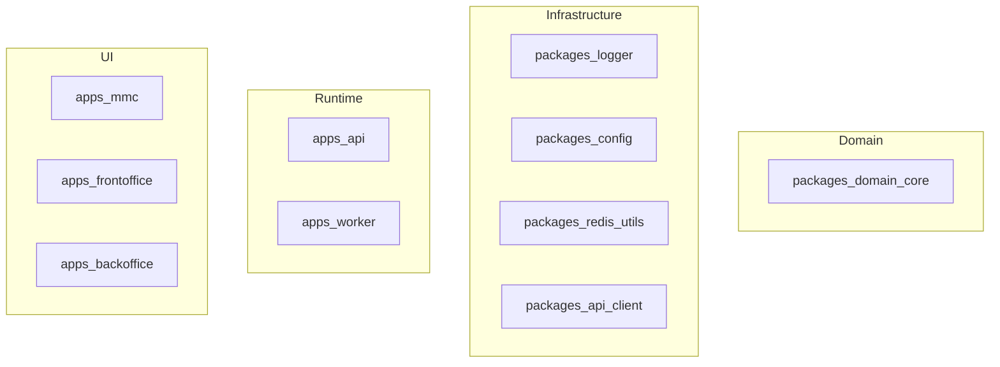
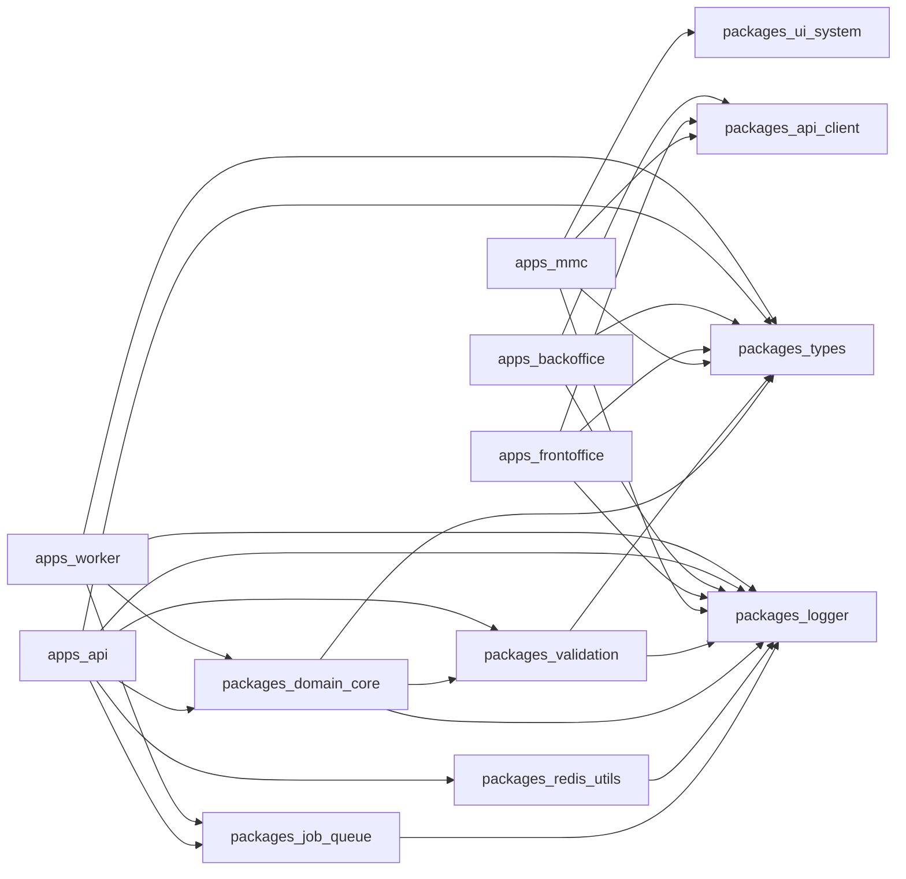
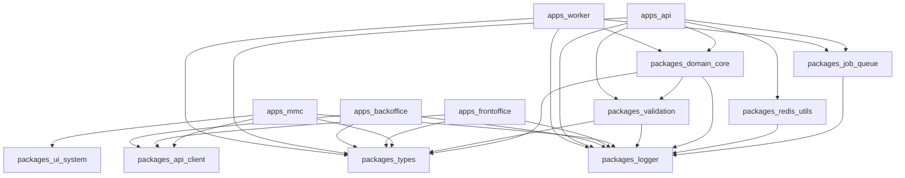

# Zidney Architecture Diagrams

Generated: 2026-04-09T08:51:17.292Z
Git SHA: 832d5f510c0bd2c6394a153457a9f037259d0dcd

---

## Architecture Overview



---

## Module Dependency Graph



---

## Full Dependency Graph



---

These diagrams are automatically generated by:

```
bun run arch:audit
```

Source data:

- AI Architecture Brain
- Dependency Graph Scanner
- ARCHITECTURE_MAP.json
