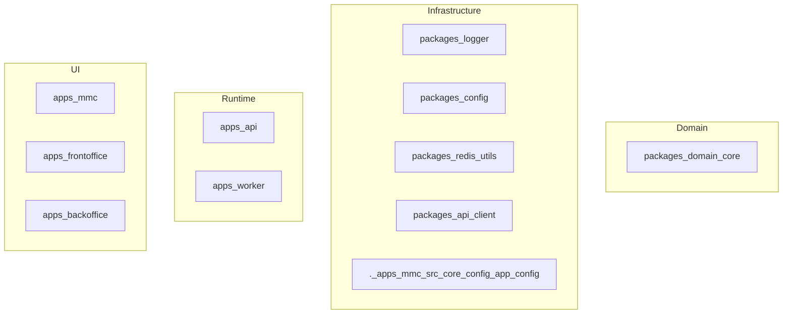

# Zidney Architecture Diagrams

Generated: 2026-03-08T20:31:02.993Z
Git SHA: e80dfd0522d1723f17b3fa13c415aa5fde134fac

---

## Architecture Overview



---

## Module Dependency Graph

```mermaid
graph LR
  packages_redis_utils --> packages_logger
  packages_redis_utils --> packages_logger
  packages_redis_utils --> packages_logger
  packages_ui_system --> ._apps_mmc_srcvue_test_utils
  packages_ui_system --> ._apps_mmc_srcvue_test_utils
  packages_ui_system --> ._apps_mmc_srctailwindcss_vite
  packages_ui_system --> ._apps_mmc_srcvitejs_plugin_vue
  packages_ui_system --> ._apps_mmc_srcvitejs_plugin_vue
  packages_ui_system --> ._apps_mmc_srcvueuse_core
  packages_ui_system --> ._apps_mmc_srcunovis_vue
  packages_ui_system --> ._apps_mmc_srcvueuse_core
  packages_ui_system --> ._apps_mmc_srctanstack_vue_table
  packages_ui_system --> ._apps_mmc_srctanstack_vue_table
  packages_domain_core --> packages_app
  packages_domain_core --> packages_app
  packages_domain_core --> packages_logger
  packages_domain_core --> packages_logger
  packages_domain_core --> packages_logger
  packages_domain_core --> packages_logger
  packages_domain_core --> packages_types
  packages_domain_core --> packages_types
  packages_domain_core --> packages_validation
  packages_domain_core --> packages_logger
  packages_domain_core --> packages_logger
  packages_domain_core --> packages_logger
  packages_domain_core --> packages_logger
  packages_domain_core --> packages_logger
  packages_domain_core --> packages_logger
  packages_domain_core --> packages_logger
  packages_domain_core --> packages_logger
  packages_domain_core --> packages_logger
  packages_domain_core --> packages_types
  packages_domain_core --> packages_logger
  packages_domain_core --> packages_logger
  packages_domain_core --> packages_logger
  packages_domain_core --> packages_logger
  packages_domain_core --> packages_logger
  packages_domain_core --> packages_types
  packages_domain_core --> packages_types
  packages_domain_core --> packages_validation
  packages_domain_core --> packages_types
  packages_domain_core --> packages_validation
  packages_domain_core --> packages_types
  packages_domain_core --> packages_types
  packages_domain_core --> packages_validation
  packages_domain_core --> packages_logger
  packages_domain_core --> packages_logger
  packages_domain_core --> packages_logger
  packages_domain_core --> packages_logger
  packages_domain_core --> packages_types
  packages_domain_core --> packages_types
  packages_domain_core --> packages_logger
  packages_domain_core --> packages_types
  packages_domain_core --> packages_types
  packages_domain_core --> packages_types
  packages_domain_core --> packages_validation
  packages_domain_core --> packages_types
  packages_domain_core --> packages_logger
  packages_domain_core --> packages_validation
  packages_validation --> packages_types
  packages_validation --> packages_types
  packages_validation --> packages_types
  packages_validation --> packages_types
  packages_validation --> packages_logger
  packages_validation --> packages_types
  apps_mmc --> ._apps_mmc_srcpinia_testing
  apps_mmc --> ._apps_mmc_srcvue_test_utils
  apps_mmc --> ._apps_mmc_src_composables_useBreakpoint
  apps_mmc --> ._apps_mmc_src_core_state_ui.store
  apps_mmc --> ._apps_mmc_src_core_auth_token_redact
  apps_mmc --> ._apps_mmc_src_core_state_app.store
  apps_mmc --> ._apps_mmc_src_core_state_ui.store
  apps_mmc --> ._apps_mmc_src_core_auth_types
  apps_mmc --> ._apps_mmc_src_core_state_auth.store
  apps_mmc --> ._apps_mmc_src_core_state_notification.store
  apps_mmc --> ._apps_mmc_src_core_state_notification.store
  apps_mmc --> ._apps_mmc_src_core_state_ui.store
  apps_mmc --> ._apps_mmc_srcpinia_testing
  apps_mmc --> ._apps_mmc_srcvue_test_utils
  apps_mmc --> ._apps_mmc_src_components_layout_AppSidebar.vue
  apps_mmc --> ._apps_mmc_src_core_navigation_index
  apps_mmc --> ._apps_mmc_srcpinia_testing
  apps_mmc --> ._apps_mmc_srcvue_test_utils
  apps_mmc --> ._apps_mmc_src_components_layout_AppLayout.vue
  apps_mmc --> ._apps_mmc_srcpinia_testing
  apps_mmc --> ._apps_mmc_srcvue_test_utils
  apps_mmc --> ._apps_mmc_src_components_layout_AppHeader.vue
  apps_mmc --> ._apps_mmc_src_core_state_app.store
  apps_mmc --> ._apps_mmc_srcpinia_testing
  apps_mmc --> ._apps_mmc_srcvue_test_utils
  apps_mmc --> ._apps_mmc_src_App.vue
  apps_mmc --> ._apps_mmc_src_components_layout_AppLayout.vue
  apps_mmc --> ._apps_mmc_srcplaywright_test
  apps_mmc --> ._apps_mmc_srcplaywright_test
  apps_mmc --> ._apps_mmc_srcvitejs_plugin_vue
  apps_mmc --> ._apps_mmc_srcvitejs_plugin_vue
  apps_mmc --> ._apps_mmc_src_core_state_ui.store
  apps_mmc --> packages_types
  apps_mmc --> packages_types
  apps_mmc --> packages_types
  apps_mmc --> packages_logger
  apps_mmc --> packages_api_client
  apps_mmc --> packages_logger
  apps_mmc --> packages_logger
  apps_mmc --> packages_logger
  apps_mmc --> packages_logger
  apps_mmc --> packages_api_client
  apps_mmc --> packages_api_client
  apps_mmc --> packages_logger
  apps_mmc --> ._apps_mmc_src_core_api_interceptors_error.interceptor
  apps_mmc --> ._apps_mmc_src_core_auth_refresh_manager
  apps_mmc --> ._apps_mmc_src_core_auth_token_manager
  apps_mmc --> ._apps_mmc_src_core_config_app_config
  apps_mmc --> packages_api_client
  apps_mmc --> packages_api_client
  apps_mmc --> packages_logger
  apps_mmc --> packages_logger
  apps_mmc --> packages_logger
  apps_mmc --> ._apps_mmc_src_modules_dashboard_routes
  apps_mmc --> ._apps_mmc_src_modules_licenses_routes
  apps_mmc --> ._apps_mmc_src_core_api_client
  apps_mmc --> ._apps_mmc_src_core_api_client
  apps_mmc --> ._apps_mmc_src_core_api_interceptors_error.interceptor
  apps_mmc --> ._apps_mmc_src_core_auth_auth.service
  apps_mmc --> ._apps_mmc_src_core_auth_auth.service
  apps_mmc --> ._apps_mmc_src_core_auth_refresh_manager
  apps_mmc --> ._apps_mmc_src_core_auth_refresh_manager
  apps_mmc --> ._apps_mmc_src_core_auth_token_manager
  apps_mmc --> ._apps_mmc_src_core_guards
  apps_mmc --> ._apps_mmc_src_core_router
  apps_mmc --> ._apps_mmc_src_core_state_auth.store
  apps_mmc --> ._apps_mmc_src_core_state_license_status.store
  apps_mmc --> ._apps_mmc_src_modules_dashboard_store
  apps_mmc --> packages_ui
  apps_mmc --> ._apps_mmc_src_modules_dashboard_api
  apps_frontoffice --> ._apps_mmc_srcpinia_testing
  apps_frontoffice --> ._apps_mmc_srcvue_test_utils
  apps_frontoffice --> ._apps_mmc_src_composables_useBreakpoint
  apps_frontoffice --> ._apps_mmc_src_core_state_ui.store
  apps_frontoffice --> ._apps_mmc_src_core_auth_token_redact
  apps_frontoffice --> ._apps_mmc_src_core_state_app.store
  apps_frontoffice --> ._apps_mmc_src_core_state_ui.store
  apps_frontoffice --> ._apps_mmc_src_core_auth_types
  apps_frontoffice --> ._apps_mmc_src_core_state_auth.store
  apps_frontoffice --> ._apps_mmc_src_core_state_notification.store
  apps_frontoffice --> ._apps_mmc_src_core_state_notification.store
  apps_frontoffice --> ._apps_mmc_src_core_auth_types
  apps_frontoffice --> ._apps_mmc_src_core_state_auth.store
  apps_frontoffice --> ._apps_mmc_src_core_state_ui.store
  apps_frontoffice --> ._apps_mmc_srcpinia_testing
  apps_frontoffice --> ._apps_mmc_srcvue_test_utils
  apps_frontoffice --> ._apps_mmc_src_components_layout_AppSidebar.vue
  apps_frontoffice --> ._apps_mmc_src_core_navigation_index
  apps_frontoffice --> ._apps_mmc_srcpinia_testing
  apps_frontoffice --> ._apps_mmc_srcvue_test_utils
  apps_frontoffice --> ._apps_mmc_src_components_layout_AppLayout.vue
  apps_frontoffice --> ._apps_mmc_srcpinia_testing
  apps_frontoffice --> ._apps_mmc_srcvue_test_utils
  apps_frontoffice --> ._apps_mmc_src_components_layout_AppHeader.vue
  apps_frontoffice --> ._apps_mmc_src_core_state_app.store
  apps_frontoffice --> ._apps_mmc_srcpinia_testing
  apps_frontoffice --> ._apps_mmc_srcvue_test_utils
  apps_frontoffice --> ._apps_mmc_src_App.vue
  apps_frontoffice --> ._apps_mmc_src_components_layout_AppLayout.vue
  apps_frontoffice --> ._apps_mmc_srcplaywright_test
  apps_frontoffice --> ._apps_mmc_srcplaywright_test
  apps_frontoffice --> ._apps_mmc_srcvitejs_plugin_vue
  apps_frontoffice --> ._apps_mmc_srcvitejs_plugin_vue
  apps_frontoffice --> packages_types
  apps_frontoffice --> packages_types
  apps_frontoffice --> packages_types
  apps_frontoffice --> packages_logger
  apps_frontoffice --> packages_api_client
  apps_frontoffice --> packages_logger
  apps_frontoffice --> packages_logger
  apps_frontoffice --> packages_logger
  apps_frontoffice --> packages_logger
  apps_frontoffice --> packages_api_client
  apps_frontoffice --> packages_api_client
  apps_frontoffice --> packages_logger
  apps_frontoffice --> ._apps_mmc_src_core_api_interceptors_error.interceptor
  apps_frontoffice --> ._apps_mmc_src_core_auth_refresh_manager
  apps_frontoffice --> ._apps_mmc_src_core_auth_token_manager
  apps_frontoffice --> ._apps_mmc_src_core_auth_token_store
  apps_frontoffice --> ._apps_mmc_src_core_config_app_config
  apps_frontoffice --> ._apps_mmc_src_core_config_app_config
  apps_frontoffice --> packages_api_client
  apps_frontoffice --> packages_api_client
  apps_frontoffice --> packages_logger
  apps_frontoffice --> packages_logger
  apps_frontoffice --> packages_logger
  apps_frontoffice --> ._apps_mmc_src_core_api_client
  apps_frontoffice --> ._apps_mmc_src_core_api_client
  apps_frontoffice --> ._apps_mmc_src_core_api_interceptors_error.interceptor
  apps_frontoffice --> ._apps_mmc_src_core_auth_auth.service
  apps_frontoffice --> ._apps_mmc_src_core_auth_auth.service
  apps_frontoffice --> ._apps_mmc_src_core_auth_refresh_manager
  apps_frontoffice --> ._apps_mmc_src_core_auth_refresh_manager
  apps_frontoffice --> ._apps_mmc_src_core_auth_token_manager
  apps_frontoffice --> ._apps_mmc_src_core_guards
  apps_frontoffice --> ._apps_mmc_src_core_router
  apps_frontoffice --> ._apps_mmc_src_core_state_auth.store
  apps_frontoffice --> ._apps_mmc_src_core_state_license_status.store
  apps_backoffice --> ._apps_mmc_src_composables_usePermission
  apps_backoffice --> ._apps_mmc_srcpinia_testing
  apps_backoffice --> ._apps_mmc_srcvue_test_utils
  apps_backoffice --> ._apps_mmc_src_composables_useBreakpoint
  apps_backoffice --> ._apps_mmc_src_core_state_ui.store
  apps_backoffice --> ._apps_mmc_src_core_state_app.store
  apps_backoffice --> ._apps_mmc_src_core_state_ui.store
  apps_backoffice --> ._apps_mmc_src_core_auth_types
  apps_backoffice --> ._apps_mmc_src_core_state_auth.store
  apps_backoffice --> packages_api_client
  apps_backoffice --> ._apps_mmc_src_core_state_workspace.store
  apps_backoffice --> ._apps_mmc_src_core_state_notification.store
  apps_backoffice --> ._apps_mmc_src_core_state_notification.store
  apps_backoffice --> ._apps_mmc_src_core_auth_types
  apps_backoffice --> ._apps_mmc_src_core_state_auth.store
  apps_backoffice --> ._apps_mmc_src_core_state_ui.store
  apps_backoffice --> ._apps_mmc_srcpinia_testing
  apps_backoffice --> ._apps_mmc_srcvue_test_utils
  apps_backoffice --> ._apps_mmc_src_components_layout_AppSidebar.vue
  apps_backoffice --> ._apps_mmc_src_core_navigation_index
  apps_backoffice --> ._apps_mmc_srcpinia_testing
  apps_backoffice --> ._apps_mmc_srcvue_test_utils
  apps_backoffice --> ._apps_mmc_src_components_layout_AppLayout.vue
  apps_backoffice --> ._apps_mmc_srcpinia_testing
  apps_backoffice --> ._apps_mmc_srcvue_test_utils
  apps_backoffice --> ._apps_mmc_src_components_layout_AppHeader.vue
  apps_backoffice --> ._apps_mmc_src_core_state_app.store
  apps_backoffice --> ._apps_mmc_src_core_state_workspace.store
  apps_backoffice --> ._apps_mmc_srcpinia_testing
  apps_backoffice --> ._apps_mmc_srcvue_test_utils
  apps_backoffice --> ._apps_mmc_src_App.vue
  apps_backoffice --> ._apps_mmc_src_components_layout_AppLayout.vue
  apps_backoffice --> ._apps_mmc_srcplaywright_test
  apps_backoffice --> ._apps_mmc_srcplaywright_test
  apps_backoffice --> ._apps_mmc_srcvitejs_plugin_vue
  apps_backoffice --> ._apps_mmc_srcvitejs_plugin_vue
  apps_backoffice --> packages_types
  apps_backoffice --> packages_types
  apps_backoffice --> packages_types
  apps_backoffice --> packages_types
  apps_backoffice --> packages_logger
  apps_backoffice --> packages_api_client
  apps_backoffice --> packages_logger
  apps_backoffice --> packages_logger
  apps_backoffice --> packages_logger
  apps_backoffice --> packages_api_client
  apps_backoffice --> packages_logger
  apps_backoffice --> packages_logger
  apps_backoffice --> packages_api_client
  apps_backoffice --> packages_api_client
  apps_backoffice --> packages_logger
  apps_backoffice --> ._apps_mmc_src_core_api_interceptors_error.interceptor
  apps_backoffice --> ._apps_mmc_src_core_auth_refresh_manager
  apps_backoffice --> ._apps_mmc_src_core_auth_token_manager
  apps_backoffice --> ._apps_mmc_src_core_auth_token_store
  apps_backoffice --> ._apps_mmc_src_core_config_app_config
  apps_backoffice --> ._apps_mmc_src_core_config_app_config
  apps_backoffice --> packages_api_client
  apps_backoffice --> packages_api_client
  apps_backoffice --> packages_logger
  apps_backoffice --> packages_logger
  apps_backoffice --> packages_logger
  apps_backoffice --> packages_logger
  apps_backoffice --> ._apps_mmc_src_core_api_client
  apps_backoffice --> ._apps_mmc_src_core_api_client
  apps_backoffice --> ._apps_mmc_src_core_api_interceptors_error.interceptor
  apps_backoffice --> ._apps_mmc_src_core_auth_auth.service
  apps_backoffice --> ._apps_mmc_src_core_auth_auth.service
  apps_backoffice --> ._apps_mmc_src_core_auth_refresh_manager
  apps_backoffice --> ._apps_mmc_src_core_auth_refresh_manager
  apps_backoffice --> ._apps_mmc_src_core_auth_token_manager
  apps_backoffice --> ._apps_mmc_src_core_state_auth.store
  apps_backoffice --> ._apps_mmc_src_core_state_license_status.store
  apps_backoffice --> ._apps_mmc_src_stores_context
  apps_backoffice --> packages_types
  apps_api --> packages_types
  apps_api --> packages_types
  apps_api --> packages_types
  apps_api --> packages_types
  apps_api --> packages_validation
  apps_api --> packages_validation
  apps_api --> packages_logger
  apps_api --> packages_types
  apps_api --> packages_logger
  apps_api --> packages_domain_core
  apps_api --> packages_domain_core
  apps_api --> packages_logger
  apps_api --> packages_types
  apps_api --> packages_types
  apps_api --> packages_types
  apps_api --> packages_types
  apps_api --> packages_types
  apps_api --> packages_types
  apps_api --> packages_types
  apps_api --> packages_types
  apps_api --> packages_types
  apps_api --> packages_types
  apps_api --> packages_types
  apps_api --> packages_domain_core
  apps_api --> packages_domain_core
  apps_api --> packages_logger
  apps_api --> packages_domain_core
  apps_api --> packages_logger
  apps_api --> packages_logger
  apps_api --> packages_domain_core
  apps_api --> packages_domain_core
  apps_api --> packages_logger
  apps_api --> packages_logger
  apps_api --> packages_types
  apps_api --> packages_logger
  apps_api --> packages_types
  apps_api --> packages_logger
  apps_api --> packages_types
  apps_api --> packages_domain_core
  apps_api --> packages_logger
  apps_api --> packages_domain_core
  apps_api --> packages_logger
  apps_api --> packages_logger
  apps_api --> packages_types
  apps_api --> packages_logger
  apps_api --> packages_redis_utils
  apps_api --> packages_redis_utils
  apps_api --> packages_logger
  apps_api --> packages_logger
  apps_api --> packages_domain_core
  apps_api --> packages_logger
  apps_api --> packages_domain_core
  apps_api --> packages_logger
  apps_api --> packages_domain_core
  apps_api --> packages_logger
  apps_api --> packages_logger
  apps_api --> packages_logger
  apps_api --> packages_domain_core
  apps_api --> packages_logger
  apps_api --> packages_logger
  apps_api --> packages_domain_core
  apps_api --> packages_logger
  apps_api --> packages_logger
  apps_api --> packages_logger
  apps_api --> packages_domain_core
  apps_api --> packages_logger
  apps_api --> packages_domain_core
  apps_api --> packages_logger
  apps_api --> packages_logger
  apps_api --> packages_logger
  apps_api --> packages_domain_core
  apps_api --> packages_logger
  apps_api --> packages_types
  apps_api --> packages_logger
  apps_api --> packages_logger
  apps_api --> packages_logger
  apps_api --> packages_logger
  apps_api --> packages_logger
  apps_api --> packages_types
  apps_api --> packages_logger
  apps_api --> packages_logger
  apps_api --> packages_domain_core
  apps_api --> packages_logger
  apps_api --> packages_logger
  apps_api --> packages_logger
  apps_api --> packages_logger
  apps_api --> packages_logger
  apps_api --> packages_logger
  apps_api --> packages_logger
  apps_api --> packages_logger
  apps_api --> packages_domain_core
  apps_api --> packages_domain_core
  apps_api --> packages_domain_core
  apps_api --> packages_logger
  apps_api --> packages_logger
  apps_api --> packages_logger
  apps_api --> packages_logger
  apps_api --> packages_logger
  apps_api --> packages_logger
  apps_api --> packages_logger
  apps_api --> packages_logger
  apps_api --> packages_types
  apps_api --> packages_logger
  apps_api --> packages_domain_core
  apps_api --> packages_logger
  apps_api --> ._apps_mmc_src_responses_license_error_handler
  apps_api --> ._apps_mmc_src_logging
  apps_api --> packages_logger
  apps_api --> packages_logger
  apps_api --> packages_logger
  apps_api --> packages_types
  apps_api --> packages_logger
  apps_api --> packages_domain_core
  apps_api --> packages_logger
  apps_api --> packages_types
  apps_api --> packages_logger
  apps_api --> packages_logger
  apps_api --> packages_logger
  apps_api --> packages_logger
  apps_api --> packages_logger
  apps_api --> packages_logger
  apps_api --> packages_domain_core
  apps_api --> packages_domain_core
  apps_api --> packages_logger
  apps_api --> packages_logger
  apps_api --> packages_domain_core
  apps_api --> packages_logger
  apps_api --> packages_logger
  apps_api --> packages_logger
  apps_api --> packages_logger
  apps_api --> packages_domain_core
  apps_api --> packages_logger
  apps_api --> packages_logger
  apps_api --> packages_logger
  apps_api --> packages_logger
  apps_api --> packages_logger
  apps_api --> packages_domain_core
  apps_api --> packages_logger
  apps_api --> packages_logger
  apps_api --> packages_logger
  apps_api --> packages_logger
  apps_api --> packages_types
  apps_api --> packages_logger
  apps_api --> packages_logger
  apps_api --> packages_logger
  apps_api --> packages_app
  apps_api --> packages_app
  apps_api --> packages_logger
  apps_api --> packages_app
  apps_api --> packages_logger
  apps_api --> packages_logger
  apps_api --> packages_logger
  apps_api --> packages_domain_core
  apps_api --> packages_domain_core
  apps_api --> packages_domain_core
  apps_api --> packages_domain_core
  apps_api --> packages_logger
  apps_api --> packages_domain_core
  apps_api --> packages_logger
  apps_api --> packages_logger
  apps_api --> packages_domain_core
  apps_api --> packages_logger
  apps_api --> packages_types
  apps_api --> packages_types
  apps_api --> packages_validation
  apps_api --> packages_domain_core
  apps_api --> packages_logger
  apps_api --> packages_domain_core
  apps_api --> packages_logger
  apps_api --> packages_domain_core
  apps_api --> packages_domain_core
  apps_api --> packages_domain_core
  apps_api --> packages_logger
  apps_api --> packages_domain_core
  apps_api --> packages_domain_core
  apps_api --> packages_domain_core
  apps_api --> packages_logger
  apps_api --> packages_domain_core
  apps_api --> packages_logger
  apps_api --> packages_domain_core
  apps_api --> packages_domain_core
  apps_api --> packages_domain_core
  apps_api --> packages_logger
  apps_api --> packages_types
  apps_api --> packages_types
  apps_api --> packages_types
  apps_api --> packages_types
  apps_api --> packages_domain_core
  apps_api --> packages_domain_core
  apps_api --> packages_domain_core
  apps_api --> packages_logger
  apps_api --> packages_types
  apps_api --> packages_domain_core
  apps_api --> packages_logger
  apps_api --> ._apps_mmc_srchono_zod_validator
  apps_api --> ._apps_mmc_srchono_zod_validator
  apps_api --> ._apps_mmc_srchono_zod_validator
  apps_api --> ._apps_mmc_srchono_zod_validator
  apps_api --> ._apps_mmc_srchono_zod_validator
  apps_api --> ._apps_mmc_srchono_zod_validator
  apps_api --> packages_domain_core
  apps_api --> packages_logger
  apps_api --> ._apps_mmc_srchono_zod_validator
  apps_api --> packages_domain_core
  apps_api --> packages_logger
  apps_api --> packages_logger
  apps_api --> packages_validation
  apps_api --> packages_logger
  apps_api --> packages_logger
  apps_api --> packages_redis_utils
  apps_api --> packages_types
  apps_api --> packages_domain_core
  apps_api --> packages_logger
  apps_api --> packages_domain_core
  apps_api --> packages_logger
  apps_api --> packages_logger
  apps_api --> packages_domain_core
  apps_api --> packages_logger
  apps_api --> packages_domain_core
  apps_api --> packages_domain_core
  apps_api --> packages_domain_core
  apps_api --> packages_domain_core
  apps_api --> packages_domain_core
  apps_api --> packages_domain_core
  apps_api --> packages_types
  apps_api --> packages_types
  apps_api --> packages_domain_core
  apps_api --> packages_logger
  apps_api --> packages_logger
  apps_api --> packages_logger
  apps_api --> packages_logger
  apps_api --> packages_logger
  apps_api --> packages_logger
  apps_api --> packages_logger
  apps_api --> packages_logger
  apps_api --> packages_domain_core
  apps_api --> packages_domain_core
  apps_api --> packages_domain_core
  apps_api --> packages_logger
  apps_api --> packages_types
  apps_api --> packages_types
  apps_api --> packages_logger
  apps_api --> packages_logger
  apps_api --> packages_types
  apps_api --> packages_types
  apps_api --> packages_types
  apps_api --> packages_logger
  apps_api --> packages_types
  apps_api --> packages_types
  apps_api --> packages_types
  apps_api --> packages_logger
  apps_api --> packages_logger
  apps_api --> packages_logger
  apps_api --> packages_types
  apps_api --> packages_types
  apps_api --> packages_logger
  apps_api --> packages_logger
  apps_api --> packages_logger
  apps_api --> packages_logger
  apps_api --> packages_types
  apps_api --> packages_types
  apps_api --> packages_logger
  apps_api --> packages_logger
  apps_api --> packages_domain_core
  apps_api --> packages_domain_core
  apps_api --> packages_domain_core
  apps_api --> packages_domain_core
  apps_worker --> packages_types
  apps_worker --> packages_domain_core
  apps_worker --> packages_types
  apps_worker --> packages_types
  apps_worker --> packages_types
  apps_worker --> packages_logger
  apps_worker --> packages_logger
  apps_worker --> packages_domain_core
  apps_worker --> packages_logger
  apps_worker --> packages_logger
  apps_worker --> packages_types
  apps_worker --> packages_logger
  apps_worker --> packages_logger
  apps_worker --> packages_types
  apps_worker --> packages_logger
  apps_worker --> packages_logger
  apps_worker --> packages_logger
  apps_worker --> packages_types
  apps_worker --> packages_logger
  apps_worker --> packages_types
  apps_worker --> packages_logger
  apps_worker --> packages_types
  apps_worker --> packages_logger
  apps_worker --> packages_logger
  apps_worker --> packages_logger
  apps_worker --> packages_logger
  apps_worker --> packages_types
  apps_worker --> packages_domain_core
  apps_worker --> packages_logger
  apps_worker --> packages_types
  apps_worker --> packages_logger
  apps_worker --> packages_logger
  apps_worker --> packages_types
  apps_worker --> packages_logger
  apps_worker --> packages_logger
  apps_worker --> packages_logger
  apps_worker --> packages_logger
  apps_worker --> packages_logger
  apps_worker --> packages_domain_core
  apps_worker --> packages_logger
  apps_worker --> packages_logger
  apps_worker --> packages_types
  apps_worker --> ._apps_mmc_srcaws_sdk_client_s3
  apps_worker --> packages_logger
  apps_worker --> packages_logger
  apps_worker --> packages_domain_core
  apps_worker --> packages_logger
  apps_worker --> packages_logger
  apps_worker --> packages_domain_core
  apps_worker --> packages_logger
  apps_worker --> packages_domain_core
  apps_worker --> packages_types
  apps_worker --> packages_logger
  apps_worker --> packages_logger
  apps_worker --> packages_logger
  apps_worker --> packages_logger
  apps_worker --> packages_logger
  apps_worker --> packages_logger
  apps_worker --> packages_logger
  apps_worker --> packages_logger
  apps_worker --> packages_types
  apps_worker --> packages_types
  apps_worker --> packages_types
  apps_worker --> packages_types
  apps_worker --> packages_types
  apps_worker --> packages_types
  apps_worker --> packages_logger
  apps_worker --> packages_logger
  apps_worker --> packages_logger
  apps_worker --> packages_logger
  apps_worker --> packages_logger
  apps_worker --> packages_logger
  apps_worker --> packages_logger
  apps_worker --> packages_logger
  apps_worker --> packages_types
  apps_worker --> packages_domain_core
  apps_worker --> packages_logger
  apps_worker --> packages_types

```

---

## Full Dependency Graph

```mermaid
graph TD
  packages_redis_utils --> packages_logger
  packages_redis_utils --> packages_logger
  packages_redis_utils --> packages_logger
  packages_ui_system --> ._apps_mmc_srcvue_test_utils
  packages_ui_system --> ._apps_mmc_srcvue_test_utils
  packages_ui_system --> ._apps_mmc_srctailwindcss_vite
  packages_ui_system --> ._apps_mmc_srcvitejs_plugin_vue
  packages_ui_system --> ._apps_mmc_srcvitejs_plugin_vue
  packages_ui_system --> ._apps_mmc_srcvueuse_core
  packages_ui_system --> ._apps_mmc_srcunovis_vue
  packages_ui_system --> ._apps_mmc_srcvueuse_core
  packages_ui_system --> ._apps_mmc_srctanstack_vue_table
  packages_ui_system --> ._apps_mmc_srctanstack_vue_table
  packages_domain_core --> packages_app
  packages_domain_core --> packages_app
  packages_domain_core --> packages_logger
  packages_domain_core --> packages_logger
  packages_domain_core --> packages_logger
  packages_domain_core --> packages_logger
  packages_domain_core --> packages_types
  packages_domain_core --> packages_types
  packages_domain_core --> packages_validation
  packages_domain_core --> packages_logger
  packages_domain_core --> packages_logger
  packages_domain_core --> packages_logger
  packages_domain_core --> packages_logger
  packages_domain_core --> packages_logger
  packages_domain_core --> packages_logger
  packages_domain_core --> packages_logger
  packages_domain_core --> packages_logger
  packages_domain_core --> packages_logger
  packages_domain_core --> packages_types
  packages_domain_core --> packages_logger
  packages_domain_core --> packages_logger
  packages_domain_core --> packages_logger
  packages_domain_core --> packages_logger
  packages_domain_core --> packages_logger
  packages_domain_core --> packages_types
  packages_domain_core --> packages_types
  packages_domain_core --> packages_validation
  packages_domain_core --> packages_types
  packages_domain_core --> packages_validation
  packages_domain_core --> packages_types
  packages_domain_core --> packages_types
  packages_domain_core --> packages_validation
  packages_domain_core --> packages_logger
  packages_domain_core --> packages_logger
  packages_domain_core --> packages_logger
  packages_domain_core --> packages_logger
  packages_domain_core --> packages_types
  packages_domain_core --> packages_types
  packages_domain_core --> packages_logger
  packages_domain_core --> packages_types
  packages_domain_core --> packages_types
  packages_domain_core --> packages_types
  packages_domain_core --> packages_validation
  packages_domain_core --> packages_types
  packages_domain_core --> packages_logger
  packages_domain_core --> packages_validation
  packages_validation --> packages_types
  packages_validation --> packages_types
  packages_validation --> packages_types
  packages_validation --> packages_types
  packages_validation --> packages_logger
  packages_validation --> packages_types
  apps_mmc --> ._apps_mmc_srcpinia_testing
  apps_mmc --> ._apps_mmc_srcvue_test_utils
  apps_mmc --> ._apps_mmc_src_composables_useBreakpoint
  apps_mmc --> ._apps_mmc_src_core_state_ui.store
  apps_mmc --> ._apps_mmc_src_core_auth_token_redact
  apps_mmc --> ._apps_mmc_src_core_state_app.store
  apps_mmc --> ._apps_mmc_src_core_state_ui.store
  apps_mmc --> ._apps_mmc_src_core_auth_types
  apps_mmc --> ._apps_mmc_src_core_state_auth.store
  apps_mmc --> ._apps_mmc_src_core_state_notification.store
  apps_mmc --> ._apps_mmc_src_core_state_notification.store
  apps_mmc --> ._apps_mmc_src_core_state_ui.store
  apps_mmc --> ._apps_mmc_srcpinia_testing
  apps_mmc --> ._apps_mmc_srcvue_test_utils
  apps_mmc --> ._apps_mmc_src_components_layout_AppSidebar.vue
  apps_mmc --> ._apps_mmc_src_core_navigation_index
  apps_mmc --> ._apps_mmc_srcpinia_testing
  apps_mmc --> ._apps_mmc_srcvue_test_utils
  apps_mmc --> ._apps_mmc_src_components_layout_AppLayout.vue
  apps_mmc --> ._apps_mmc_srcpinia_testing
  apps_mmc --> ._apps_mmc_srcvue_test_utils
  apps_mmc --> ._apps_mmc_src_components_layout_AppHeader.vue
  apps_mmc --> ._apps_mmc_src_core_state_app.store
  apps_mmc --> ._apps_mmc_srcpinia_testing
  apps_mmc --> ._apps_mmc_srcvue_test_utils
  apps_mmc --> ._apps_mmc_src_App.vue
  apps_mmc --> ._apps_mmc_src_components_layout_AppLayout.vue
  apps_mmc --> ._apps_mmc_srcplaywright_test
  apps_mmc --> ._apps_mmc_srcplaywright_test
  apps_mmc --> ._apps_mmc_srcvitejs_plugin_vue
  apps_mmc --> ._apps_mmc_srcvitejs_plugin_vue
  apps_mmc --> ._apps_mmc_src_core_state_ui.store
  apps_mmc --> packages_types
  apps_mmc --> packages_types
  apps_mmc --> packages_types
  apps_mmc --> packages_logger
  apps_mmc --> packages_api_client
  apps_mmc --> packages_logger
  apps_mmc --> packages_logger
  apps_mmc --> packages_logger
  apps_mmc --> packages_logger
  apps_mmc --> packages_api_client
  apps_mmc --> packages_api_client
  apps_mmc --> packages_logger
  apps_mmc --> ._apps_mmc_src_core_api_interceptors_error.interceptor
  apps_mmc --> ._apps_mmc_src_core_auth_refresh_manager
  apps_mmc --> ._apps_mmc_src_core_auth_token_manager
  apps_mmc --> ._apps_mmc_src_core_config_app_config
  apps_mmc --> packages_api_client
  apps_mmc --> packages_api_client
  apps_mmc --> packages_logger
  apps_mmc --> packages_logger
  apps_mmc --> packages_logger
  apps_mmc --> ._apps_mmc_src_modules_dashboard_routes
  apps_mmc --> ._apps_mmc_src_modules_licenses_routes
  apps_mmc --> ._apps_mmc_src_core_api_client
  apps_mmc --> ._apps_mmc_src_core_api_client
  apps_mmc --> ._apps_mmc_src_core_api_interceptors_error.interceptor
  apps_mmc --> ._apps_mmc_src_core_auth_auth.service
  apps_mmc --> ._apps_mmc_src_core_auth_auth.service
  apps_mmc --> ._apps_mmc_src_core_auth_refresh_manager
  apps_mmc --> ._apps_mmc_src_core_auth_refresh_manager
  apps_mmc --> ._apps_mmc_src_core_auth_token_manager
  apps_mmc --> ._apps_mmc_src_core_guards
  apps_mmc --> ._apps_mmc_src_core_router
  apps_mmc --> ._apps_mmc_src_core_state_auth.store
  apps_mmc --> ._apps_mmc_src_core_state_license_status.store
  apps_mmc --> ._apps_mmc_src_modules_dashboard_store
  apps_mmc --> packages_ui
  apps_mmc --> ._apps_mmc_src_modules_dashboard_api
  apps_frontoffice --> ._apps_mmc_srcpinia_testing
  apps_frontoffice --> ._apps_mmc_srcvue_test_utils
  apps_frontoffice --> ._apps_mmc_src_composables_useBreakpoint
  apps_frontoffice --> ._apps_mmc_src_core_state_ui.store
  apps_frontoffice --> ._apps_mmc_src_core_auth_token_redact
  apps_frontoffice --> ._apps_mmc_src_core_state_app.store
  apps_frontoffice --> ._apps_mmc_src_core_state_ui.store
  apps_frontoffice --> ._apps_mmc_src_core_auth_types
  apps_frontoffice --> ._apps_mmc_src_core_state_auth.store
  apps_frontoffice --> ._apps_mmc_src_core_state_notification.store
  apps_frontoffice --> ._apps_mmc_src_core_state_notification.store
  apps_frontoffice --> ._apps_mmc_src_core_auth_types
  apps_frontoffice --> ._apps_mmc_src_core_state_auth.store
  apps_frontoffice --> ._apps_mmc_src_core_state_ui.store
  apps_frontoffice --> ._apps_mmc_srcpinia_testing
  apps_frontoffice --> ._apps_mmc_srcvue_test_utils
  apps_frontoffice --> ._apps_mmc_src_components_layout_AppSidebar.vue
  apps_frontoffice --> ._apps_mmc_src_core_navigation_index
  apps_frontoffice --> ._apps_mmc_srcpinia_testing
  apps_frontoffice --> ._apps_mmc_srcvue_test_utils
  apps_frontoffice --> ._apps_mmc_src_components_layout_AppLayout.vue
  apps_frontoffice --> ._apps_mmc_srcpinia_testing
  apps_frontoffice --> ._apps_mmc_srcvue_test_utils
  apps_frontoffice --> ._apps_mmc_src_components_layout_AppHeader.vue
  apps_frontoffice --> ._apps_mmc_src_core_state_app.store
  apps_frontoffice --> ._apps_mmc_srcpinia_testing
  apps_frontoffice --> ._apps_mmc_srcvue_test_utils
  apps_frontoffice --> ._apps_mmc_src_App.vue
  apps_frontoffice --> ._apps_mmc_src_components_layout_AppLayout.vue
  apps_frontoffice --> ._apps_mmc_srcplaywright_test
  apps_frontoffice --> ._apps_mmc_srcplaywright_test
  apps_frontoffice --> ._apps_mmc_srcvitejs_plugin_vue
  apps_frontoffice --> ._apps_mmc_srcvitejs_plugin_vue
  apps_frontoffice --> packages_types
  apps_frontoffice --> packages_types
  apps_frontoffice --> packages_types
  apps_frontoffice --> packages_logger
  apps_frontoffice --> packages_api_client
  apps_frontoffice --> packages_logger
  apps_frontoffice --> packages_logger
  apps_frontoffice --> packages_logger
  apps_frontoffice --> packages_logger
  apps_frontoffice --> packages_api_client
  apps_frontoffice --> packages_api_client
  apps_frontoffice --> packages_logger
  apps_frontoffice --> ._apps_mmc_src_core_api_interceptors_error.interceptor
  apps_frontoffice --> ._apps_mmc_src_core_auth_refresh_manager
  apps_frontoffice --> ._apps_mmc_src_core_auth_token_manager
  apps_frontoffice --> ._apps_mmc_src_core_auth_token_store
  apps_frontoffice --> ._apps_mmc_src_core_config_app_config
  apps_frontoffice --> ._apps_mmc_src_core_config_app_config
  apps_frontoffice --> packages_api_client
  apps_frontoffice --> packages_api_client
  apps_frontoffice --> packages_logger
  apps_frontoffice --> packages_logger
  apps_frontoffice --> packages_logger
  apps_frontoffice --> ._apps_mmc_src_core_api_client
  apps_frontoffice --> ._apps_mmc_src_core_api_client
  apps_frontoffice --> ._apps_mmc_src_core_api_interceptors_error.interceptor
  apps_frontoffice --> ._apps_mmc_src_core_auth_auth.service
  apps_frontoffice --> ._apps_mmc_src_core_auth_auth.service
  apps_frontoffice --> ._apps_mmc_src_core_auth_refresh_manager
  apps_frontoffice --> ._apps_mmc_src_core_auth_refresh_manager
  apps_frontoffice --> ._apps_mmc_src_core_auth_token_manager
  apps_frontoffice --> ._apps_mmc_src_core_guards
  apps_frontoffice --> ._apps_mmc_src_core_router
  apps_frontoffice --> ._apps_mmc_src_core_state_auth.store
  apps_frontoffice --> ._apps_mmc_src_core_state_license_status.store
  apps_backoffice --> ._apps_mmc_src_composables_usePermission
  apps_backoffice --> ._apps_mmc_srcpinia_testing
  apps_backoffice --> ._apps_mmc_srcvue_test_utils
  apps_backoffice --> ._apps_mmc_src_composables_useBreakpoint
  apps_backoffice --> ._apps_mmc_src_core_state_ui.store
  apps_backoffice --> ._apps_mmc_src_core_state_app.store
  apps_backoffice --> ._apps_mmc_src_core_state_ui.store
  apps_backoffice --> ._apps_mmc_src_core_auth_types
  apps_backoffice --> ._apps_mmc_src_core_state_auth.store
  apps_backoffice --> packages_api_client
  apps_backoffice --> ._apps_mmc_src_core_state_workspace.store
  apps_backoffice --> ._apps_mmc_src_core_state_notification.store
  apps_backoffice --> ._apps_mmc_src_core_state_notification.store
  apps_backoffice --> ._apps_mmc_src_core_auth_types
  apps_backoffice --> ._apps_mmc_src_core_state_auth.store
  apps_backoffice --> ._apps_mmc_src_core_state_ui.store
  apps_backoffice --> ._apps_mmc_srcpinia_testing
  apps_backoffice --> ._apps_mmc_srcvue_test_utils
  apps_backoffice --> ._apps_mmc_src_components_layout_AppSidebar.vue
  apps_backoffice --> ._apps_mmc_src_core_navigation_index
  apps_backoffice --> ._apps_mmc_srcpinia_testing
  apps_backoffice --> ._apps_mmc_srcvue_test_utils
  apps_backoffice --> ._apps_mmc_src_components_layout_AppLayout.vue
  apps_backoffice --> ._apps_mmc_srcpinia_testing
  apps_backoffice --> ._apps_mmc_srcvue_test_utils
  apps_backoffice --> ._apps_mmc_src_components_layout_AppHeader.vue
  apps_backoffice --> ._apps_mmc_src_core_state_app.store
  apps_backoffice --> ._apps_mmc_src_core_state_workspace.store
  apps_backoffice --> ._apps_mmc_srcpinia_testing
  apps_backoffice --> ._apps_mmc_srcvue_test_utils
  apps_backoffice --> ._apps_mmc_src_App.vue
  apps_backoffice --> ._apps_mmc_src_components_layout_AppLayout.vue
  apps_backoffice --> ._apps_mmc_srcplaywright_test
  apps_backoffice --> ._apps_mmc_srcplaywright_test
  apps_backoffice --> ._apps_mmc_srcvitejs_plugin_vue
  apps_backoffice --> ._apps_mmc_srcvitejs_plugin_vue
  apps_backoffice --> packages_types
  apps_backoffice --> packages_types
  apps_backoffice --> packages_types
  apps_backoffice --> packages_types
  apps_backoffice --> packages_logger
  apps_backoffice --> packages_api_client
  apps_backoffice --> packages_logger
  apps_backoffice --> packages_logger
  apps_backoffice --> packages_logger
  apps_backoffice --> packages_api_client
  apps_backoffice --> packages_logger
  apps_backoffice --> packages_logger
  apps_backoffice --> packages_api_client
  apps_backoffice --> packages_api_client
  apps_backoffice --> packages_logger
  apps_backoffice --> ._apps_mmc_src_core_api_interceptors_error.interceptor
  apps_backoffice --> ._apps_mmc_src_core_auth_refresh_manager
  apps_backoffice --> ._apps_mmc_src_core_auth_token_manager
  apps_backoffice --> ._apps_mmc_src_core_auth_token_store
  apps_backoffice --> ._apps_mmc_src_core_config_app_config
  apps_backoffice --> ._apps_mmc_src_core_config_app_config
  apps_backoffice --> packages_api_client
  apps_backoffice --> packages_api_client
  apps_backoffice --> packages_logger
  apps_backoffice --> packages_logger
  apps_backoffice --> packages_logger
  apps_backoffice --> packages_logger
  apps_backoffice --> ._apps_mmc_src_core_api_client
  apps_backoffice --> ._apps_mmc_src_core_api_client
  apps_backoffice --> ._apps_mmc_src_core_api_interceptors_error.interceptor
  apps_backoffice --> ._apps_mmc_src_core_auth_auth.service
  apps_backoffice --> ._apps_mmc_src_core_auth_auth.service
  apps_backoffice --> ._apps_mmc_src_core_auth_refresh_manager
  apps_backoffice --> ._apps_mmc_src_core_auth_refresh_manager
  apps_backoffice --> ._apps_mmc_src_core_auth_token_manager
  apps_backoffice --> ._apps_mmc_src_core_state_auth.store
  apps_backoffice --> ._apps_mmc_src_core_state_license_status.store
  apps_backoffice --> ._apps_mmc_src_stores_context
  apps_backoffice --> packages_types
  apps_api --> packages_types
  apps_api --> packages_types
  apps_api --> packages_types
  apps_api --> packages_types
  apps_api --> packages_validation
  apps_api --> packages_validation
  apps_api --> packages_logger
  apps_api --> packages_types
  apps_api --> packages_logger
  apps_api --> packages_domain_core
  apps_api --> packages_domain_core
  apps_api --> packages_logger
  apps_api --> packages_types
  apps_api --> packages_types
  apps_api --> packages_types
  apps_api --> packages_types
  apps_api --> packages_types
  apps_api --> packages_types
  apps_api --> packages_types
  apps_api --> packages_types
  apps_api --> packages_types
  apps_api --> packages_types
  apps_api --> packages_types
  apps_api --> packages_domain_core
  apps_api --> packages_domain_core
  apps_api --> packages_logger
  apps_api --> packages_domain_core
  apps_api --> packages_logger
  apps_api --> packages_logger
  apps_api --> packages_domain_core
  apps_api --> packages_domain_core
  apps_api --> packages_logger
  apps_api --> packages_logger
  apps_api --> packages_types
  apps_api --> packages_logger
  apps_api --> packages_types
  apps_api --> packages_logger
  apps_api --> packages_types
  apps_api --> packages_domain_core
  apps_api --> packages_logger
  apps_api --> packages_domain_core
  apps_api --> packages_logger
  apps_api --> packages_logger
  apps_api --> packages_types
  apps_api --> packages_logger
  apps_api --> packages_redis_utils
  apps_api --> packages_redis_utils
  apps_api --> packages_logger
  apps_api --> packages_logger
  apps_api --> packages_domain_core
  apps_api --> packages_logger
  apps_api --> packages_domain_core
  apps_api --> packages_logger
  apps_api --> packages_domain_core
  apps_api --> packages_logger
  apps_api --> packages_logger
  apps_api --> packages_logger
  apps_api --> packages_domain_core
  apps_api --> packages_logger
  apps_api --> packages_logger
  apps_api --> packages_domain_core
  apps_api --> packages_logger
  apps_api --> packages_logger
  apps_api --> packages_logger
  apps_api --> packages_domain_core
  apps_api --> packages_logger
  apps_api --> packages_domain_core
  apps_api --> packages_logger
  apps_api --> packages_logger
  apps_api --> packages_logger
  apps_api --> packages_domain_core
  apps_api --> packages_logger
  apps_api --> packages_types
  apps_api --> packages_logger
  apps_api --> packages_logger
  apps_api --> packages_logger
  apps_api --> packages_logger
  apps_api --> packages_logger
  apps_api --> packages_types
  apps_api --> packages_logger
  apps_api --> packages_logger
  apps_api --> packages_domain_core
  apps_api --> packages_logger
  apps_api --> packages_logger
  apps_api --> packages_logger
  apps_api --> packages_logger
  apps_api --> packages_logger
  apps_api --> packages_logger
  apps_api --> packages_logger
  apps_api --> packages_logger
  apps_api --> packages_domain_core
  apps_api --> packages_domain_core
  apps_api --> packages_domain_core
  apps_api --> packages_logger
  apps_api --> packages_logger
  apps_api --> packages_logger
  apps_api --> packages_logger
  apps_api --> packages_logger
  apps_api --> packages_logger
  apps_api --> packages_logger
  apps_api --> packages_logger
  apps_api --> packages_types
  apps_api --> packages_logger
  apps_api --> packages_domain_core
  apps_api --> packages_logger
  apps_api --> ._apps_mmc_src_responses_license_error_handler
  apps_api --> ._apps_mmc_src_logging
  apps_api --> packages_logger
  apps_api --> packages_logger
  apps_api --> packages_logger
  apps_api --> packages_types
  apps_api --> packages_logger
  apps_api --> packages_domain_core
  apps_api --> packages_logger
  apps_api --> packages_types
  apps_api --> packages_logger
  apps_api --> packages_logger
  apps_api --> packages_logger
  apps_api --> packages_logger
  apps_api --> packages_logger
  apps_api --> packages_logger
  apps_api --> packages_domain_core
  apps_api --> packages_domain_core
  apps_api --> packages_logger
  apps_api --> packages_logger
  apps_api --> packages_domain_core
  apps_api --> packages_logger
  apps_api --> packages_logger
  apps_api --> packages_logger
  apps_api --> packages_logger
  apps_api --> packages_domain_core
  apps_api --> packages_logger
  apps_api --> packages_logger
  apps_api --> packages_logger
  apps_api --> packages_logger
  apps_api --> packages_logger
  apps_api --> packages_domain_core
  apps_api --> packages_logger
  apps_api --> packages_logger
  apps_api --> packages_logger
  apps_api --> packages_logger
  apps_api --> packages_types
  apps_api --> packages_logger
  apps_api --> packages_logger
  apps_api --> packages_logger
  apps_api --> packages_app
  apps_api --> packages_app
  apps_api --> packages_logger
  apps_api --> packages_app
  apps_api --> packages_logger
  apps_api --> packages_logger
  apps_api --> packages_logger
  apps_api --> packages_domain_core
  apps_api --> packages_domain_core
  apps_api --> packages_domain_core
  apps_api --> packages_domain_core
  apps_api --> packages_logger
  apps_api --> packages_domain_core
  apps_api --> packages_logger
  apps_api --> packages_logger
  apps_api --> packages_domain_core
  apps_api --> packages_logger
  apps_api --> packages_types
  apps_api --> packages_types
  apps_api --> packages_validation
  apps_api --> packages_domain_core
  apps_api --> packages_logger
  apps_api --> packages_domain_core
  apps_api --> packages_logger
  apps_api --> packages_domain_core
  apps_api --> packages_domain_core
  apps_api --> packages_domain_core
  apps_api --> packages_logger
  apps_api --> packages_domain_core
  apps_api --> packages_domain_core
  apps_api --> packages_domain_core
  apps_api --> packages_logger
  apps_api --> packages_domain_core
  apps_api --> packages_logger
  apps_api --> packages_domain_core
  apps_api --> packages_domain_core
  apps_api --> packages_domain_core
  apps_api --> packages_logger
  apps_api --> packages_types
  apps_api --> packages_types
  apps_api --> packages_types
  apps_api --> packages_types
  apps_api --> packages_domain_core
  apps_api --> packages_domain_core
  apps_api --> packages_domain_core
  apps_api --> packages_logger
  apps_api --> packages_types
  apps_api --> packages_domain_core
  apps_api --> packages_logger
  apps_api --> ._apps_mmc_srchono_zod_validator
  apps_api --> ._apps_mmc_srchono_zod_validator
  apps_api --> ._apps_mmc_srchono_zod_validator
  apps_api --> ._apps_mmc_srchono_zod_validator
  apps_api --> ._apps_mmc_srchono_zod_validator
  apps_api --> ._apps_mmc_srchono_zod_validator
  apps_api --> packages_domain_core
  apps_api --> packages_logger
  apps_api --> ._apps_mmc_srchono_zod_validator
  apps_api --> packages_domain_core
  apps_api --> packages_logger
  apps_api --> packages_logger
  apps_api --> packages_validation
  apps_api --> packages_logger
  apps_api --> packages_logger
  apps_api --> packages_redis_utils
  apps_api --> packages_types
  apps_api --> packages_domain_core
  apps_api --> packages_logger
  apps_api --> packages_domain_core
  apps_api --> packages_logger
  apps_api --> packages_logger
  apps_api --> packages_domain_core
  apps_api --> packages_logger
  apps_api --> packages_domain_core
  apps_api --> packages_domain_core
  apps_api --> packages_domain_core
  apps_api --> packages_domain_core
  apps_api --> packages_domain_core
  apps_api --> packages_domain_core
  apps_api --> packages_types
  apps_api --> packages_types
  apps_api --> packages_domain_core
  apps_api --> packages_logger
  apps_api --> packages_logger
  apps_api --> packages_logger
  apps_api --> packages_logger
  apps_api --> packages_logger
  apps_api --> packages_logger
  apps_api --> packages_logger
  apps_api --> packages_logger
  apps_api --> packages_domain_core
  apps_api --> packages_domain_core
  apps_api --> packages_domain_core
  apps_api --> packages_logger
  apps_api --> packages_types
  apps_api --> packages_types
  apps_api --> packages_logger
  apps_api --> packages_logger
  apps_api --> packages_types
  apps_api --> packages_types
  apps_api --> packages_types
  apps_api --> packages_logger
  apps_api --> packages_types
  apps_api --> packages_types
  apps_api --> packages_types
  apps_api --> packages_logger
  apps_api --> packages_logger
  apps_api --> packages_logger
  apps_api --> packages_types
  apps_api --> packages_types
  apps_api --> packages_logger
  apps_api --> packages_logger
  apps_api --> packages_logger
  apps_api --> packages_logger
  apps_api --> packages_types
  apps_api --> packages_types
  apps_api --> packages_logger
  apps_api --> packages_logger
  apps_api --> packages_domain_core
  apps_api --> packages_domain_core
  apps_api --> packages_domain_core
  apps_api --> packages_domain_core
  apps_worker --> packages_types
  apps_worker --> packages_domain_core
  apps_worker --> packages_types
  apps_worker --> packages_types
  apps_worker --> packages_types
  apps_worker --> packages_logger
  apps_worker --> packages_logger
  apps_worker --> packages_domain_core
  apps_worker --> packages_logger
  apps_worker --> packages_logger
  apps_worker --> packages_types
  apps_worker --> packages_logger
  apps_worker --> packages_logger
  apps_worker --> packages_types
  apps_worker --> packages_logger
  apps_worker --> packages_logger
  apps_worker --> packages_logger
  apps_worker --> packages_types
  apps_worker --> packages_logger
  apps_worker --> packages_types
  apps_worker --> packages_logger
  apps_worker --> packages_types
  apps_worker --> packages_logger
  apps_worker --> packages_logger
  apps_worker --> packages_logger
  apps_worker --> packages_logger
  apps_worker --> packages_types
  apps_worker --> packages_domain_core
  apps_worker --> packages_logger
  apps_worker --> packages_types
  apps_worker --> packages_logger
  apps_worker --> packages_logger
  apps_worker --> packages_types
  apps_worker --> packages_logger
  apps_worker --> packages_logger
  apps_worker --> packages_logger
  apps_worker --> packages_logger
  apps_worker --> packages_logger
  apps_worker --> packages_domain_core
  apps_worker --> packages_logger
  apps_worker --> packages_logger
  apps_worker --> packages_types
  apps_worker --> ._apps_mmc_srcaws_sdk_client_s3
  apps_worker --> packages_logger
  apps_worker --> packages_logger
  apps_worker --> packages_domain_core
  apps_worker --> packages_logger
  apps_worker --> packages_logger
  apps_worker --> packages_domain_core
  apps_worker --> packages_logger
  apps_worker --> packages_domain_core
  apps_worker --> packages_types
  apps_worker --> packages_logger
  apps_worker --> packages_logger
  apps_worker --> packages_logger
  apps_worker --> packages_logger
  apps_worker --> packages_logger
  apps_worker --> packages_logger
  apps_worker --> packages_logger
  apps_worker --> packages_logger
  apps_worker --> packages_types
  apps_worker --> packages_types
  apps_worker --> packages_types
  apps_worker --> packages_types
  apps_worker --> packages_types
  apps_worker --> packages_types
  apps_worker --> packages_logger
  apps_worker --> packages_logger
  apps_worker --> packages_logger
  apps_worker --> packages_logger
  apps_worker --> packages_logger
  apps_worker --> packages_logger
  apps_worker --> packages_logger
  apps_worker --> packages_logger
  apps_worker --> packages_types
  apps_worker --> packages_domain_core
  apps_worker --> packages_logger
  apps_worker --> packages_types
```

---

These diagrams are automatically generated by:

```
bun scripts/infra-audit.ts
```

Source data:
- AI Architecture Brain
- Dependency Graph Scanner
- ARCHITECTURE_MAP.json

