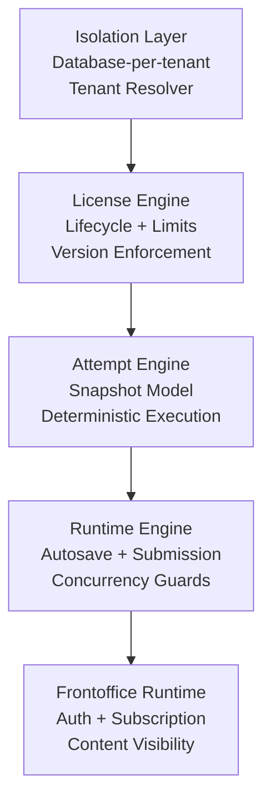

# Zidney Clean Architecture Flow

This diagram represents the architectural trust chain of Zidney.

Everything depends on isolation.

---

## What This Graph Means

Isolation  
→ guarantees workspace boundary

License  
→ guarantees commercial authority & lifecycle

Attempt  
→ guarantees exam integrity

Runtime  
→ guarantees execution stability

Frontoffice  
→ guarantees user experience on top of safe execution

---

## Why This Matters

If Isolation fails → everything fails.  
If License enforcement fails → revenue & trust fail.  
If Attempt model fails → exam integrity fails.  
If Runtime fails → concurrency collapses.  
If Frontoffice fails → UX breaks but data remains safe.

---

Open in VSCode with:

Cmd + Shift + V

(using Mermaid Markdown extension)

---

If you want, next we can generate a “Trust Boundary Diagram” that shows what runs in master_db vs
tenant_db vs worker vs client.
