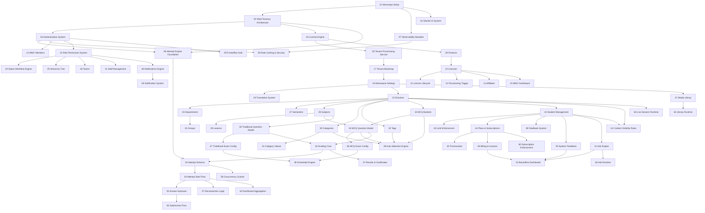

```mermaid
flowchart TD

%% =============================
%% PHASE 1 — PLATFORM FOUNDATION
%% =============================

S01[01 Monorepo Setup]

S02[02 Multi-Tenancy Architecture]
S03[03 Authentication System]
S04[04 License Engine]
S05[05 Tenant Provisioning Service]
S06[06 Attempt Engine Foundation]
S07[07 Observability Baseline]
S08[08 Rate Limiting & Security]

S01 --> S02
S02 --> S03
S02 --> S04
S04 --> S05
S02 --> S06
S03 --> S06
S01 --> S07
S03 --> S08
S07 --> S08

%% =============================
%% PHASE 2 — MMC
%% =============================

S09[09 Products]
S10[10 Licenses]
S11[11 License Lifecycle]
S12[12 Provisioning Trigger]
S13[13 Affiliates]
S14[14 MMC Members]
S15[15 MMC Dashboard]
S16[16 Shared UI System]

S04 --> S09
S09 --> S10
S10 --> S11
S10 --> S12
S10 --> S13
S03 --> S14
S10 --> S15
S01 --> S16

%% =============================
%% PHASE 3 — BACKOFFICE
%% =============================

S17[17 Tenant Bootstrap]
S18[18 Workspace Settings]
S19[19 Translation System]
S20[20 Status Workflow Engine]
S21[21 Role Permission System]

S05 --> S17
S17 --> S18
S18 --> S19
S21 --> S20
S03 --> S21

%% Academic Structure
S22[22 Divisions]
S23[23 Departments]
S24[24 Groups]
S25[25 Hierarchy Tree]
S26[26 Teams]
S27[27 Semesters]
S28[28 Subjects]
S29[29 Lessons]

S18 --> S22
S22 --> S23
S23 --> S24
S21 --> S25
S21 --> S26
S22 --> S27
S22 --> S28
S28 --> S29

%% Content Classification
S30[30 Categories]
S31[31 Category Values]
S32[32 Tags]
S33[33 MCQ Baskets]

S22 --> S30
S30 --> S31
S22 --> S32
S22 --> S33

%% Exam Engine Core
S34[34 MCQ Question Model]
S35[35 Traditional Question Model]
S36[36 MCQ Exam Config]
S37[37 Traditional Exam Config]
S38[38 Scheduled Engine]
S39[39 Auto Selection Engine]
S40[40 Grading Core]

S28 --> S34
S33 --> S34
S28 --> S35
S34 --> S36
S35 --> S37
S36 --> S38
S37 --> S38
S34 --> S39
S30 --> S39
S32 --> S39
S33 --> S39
S34 --> S40
S35 --> S40

%% User Management
S41[41 Staff Management]
S42[42 Student Management]
S43[43 Limit Enforcement]

S21 --> S41
S22 --> S42
S42 --> S43

%% Commercial
S44[44 Plans & Subscriptions]
S45[45 Promocodes]
S46[46 Billing & Invoices]

S42 --> S44
S44 --> S45
S44 --> S46

%% Media
S47[47 Media Library]
S18 --> S47

%% Communication
S48[48 Notifications Engine]
S49[49 Feedback System]
S50[50 System Feedback]

S21 --> S48
S42 --> S49
S42 --> S50

%% Ads
S51[51 Ads Engine]
S42 --> S51

%% Dashboard
S52[52 Backoffice Dashboard]
S51 --> S52
S50 --> S52
S46 --> S52

%% =============================
%% PHASE 4 — RUNTIME
%% =============================

S53[53 Attempt Schema]
S54[54 Attempt Start Flow]
S55[55 Answer Autosave]
S56[56 Submission Flow]
S57[57 Reconnection Logic]
S58[58 Concurrency Guards]

S06 --> S53
S40 --> S53
S53 --> S54
S54 --> S55
S55 --> S56
S54 --> S57
S53 --> S58

%% =============================
%% PHASE 5 — FRONTOFFICE
%% =============================

S59[59 Frontoffice Auth]
S60[60 Subscription Enforcement]
S61[61 Content Visibility Rules]
S62[62 Dashboard Aggregation]
S63[63 Library Runtime]
S64[64 Live Session Runtime]
S65[65 Notification System]
S66[66 Ads Runtime]
S67[67 Results & Certificates]

S03 --> S59
S44 --> S60
S42 --> S61
S22 --> S61
S54 --> S62
S47 --> S63
S22 --> S64
S48 --> S65
S51 --> S66
S40 --> S67
```
