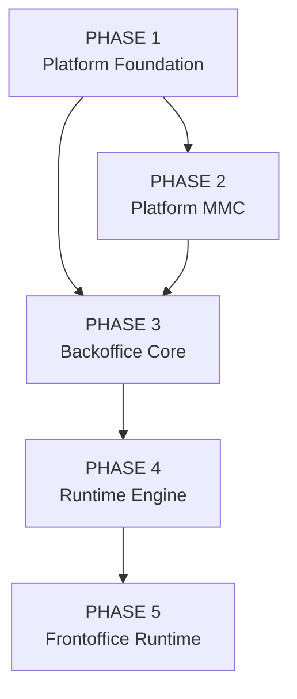

# Zidney Phase Graph (High-Level)

This diagram shows phase-level execution order and dependency flow.

---

## How to View

1. Install VSCode extension: **Markdown Preview Mermaid Support**
2. Open `PHASE_GRAPH.md`
3. Press: Cmd + Shift + V

---

### What This Represents

- Phase 1 is the foundation of everything.
- Phase 2 (MMC) depends only on core foundation.
- Phase 3 (Backoffice) depends on foundation + MMC.
- Phase 4 (Runtime) depends on Backoffice core structures.
- Phase 5 (Frontoffice) depends on Runtime stability.

---

If you want, next we can generate:

- A strict “Production Hardening Order” graph
- Or a “Revenue-First Delivery Path” graph
