# Dependency Graph: STAGE_07_OBSERVABILITY_BASELINE

**Generated**: 2026-02-18  
**Stage**: STAGE_07_OBSERVABILITY_BASELINE  
**Total Tasks**: 22  
**Total Dependencies**: 38  
**Circular Dependencies**: 0 ✅

---

## Visual Dependency DAG (Mermaid)

```mermaid
graph TD
    T001["<b>T001</b><br/>Logger Abstraction<br/><i>1.5h</i>"]
    T002["<b>T002</b><br/>Request ID Middleware<br/><i>1h</i>"]
    T003["<b>T003</b><br/>Correlation Context<br/><i>1.5h</i>"]
    T004["<b>T004</b><br/>Redaction Middleware<br/><i>1.5h</i>"]
    T005["<b>T005</b><br/>Register Middlewares<br/><i>1h</i>"]

    T006["<b>T006</b><br/>Audit Service<br/><i>1.5h</i>"]
    T007["<b>T007</b><br/>Audit Log Migration<br/><i>1h</i>"]
    T008["<b>T008</b><br/>License Integration<br/><i>1h</i>"]
    T009["<b>T009</b><br/>Provisioning Integration<br/><i>1h</i>"]

    T010["<b>T010</b><br/>Job Envelope Interface<br/><i>1h</i>"]
    T011["<b>T011</b><br/>Job Hash Function<br/><i>0.5h</i>"]
    T012["<b>T012</b><br/>Job Enqueue<br/><i>1.5h</i>"]
    T013["<b>T013</b><br/>Job Dequeue<br/><i>1.5h</i>"]
    T014["<b>T014</b><br/>Worker Logger<br/><i>1h</i>"]

    T015["<b>T015</b><br/>Grading Worker<br/><i>1h</i>"]
    T016["<b>T016</b><br/>Error Code Registry<br/><i>0.75h</i>"]
    T017["<b>T017</b><br/>Error Handler<br/><i>1.5h</i>"]

    T018["<b>T018</b><br/>Logger Unit Tests<br/><i>1h</i>"]
    T019["<b>T019</b><br/>Correlation Tests<br/><i>1.5h</i>"]
    T020["<b>T020</b><br/>Job Lifecycle Tests<br/><i>1.5h</i>"]
    T021["<b>T021</b><br/>Audit Event Tests<br/><i>1.5h</i>"]
    T022["<b>T022</b><br/>Snapshot Tests<br/><i>1h</i>"]

    %% Phase 1 Dependencies
    T001 -->|child context| T003
    T001 -->|serializers| T004
    T002 -->|provides request_id| T003
    T003 -->|binds context| T005
    T004 -->|redaction| T005

    %% Phase 2 Dependencies
    T005 -->|logger ready| T008
    T005 -->|logger ready| T009
    T006 -->|service methods| T008
    T007 -->|table exists| T008
    T006 -->|service methods| T009
    T007 -->|table exists| T009

    %% Phase 3 Dependencies
    T010 -->|QueuedJob interface| T012
    T011 -->|hash function| T012
    T010 -->|QueuedJob interface| T013
    T011 -->|hash function| T013
    T012 -->|job structure| T013
    T014 -->|job logger| T015

    %% Phase 4 Dependencies
    T016 -->|error codes| T017
    T003 -->|request_id available| T017

    %% Phase 5 Dependencies (Testing)
    T001 -->|test subject| T018
    T003 -->|test subject| T019
    T002 -->|test subject| T019
    T010 -->|test subject| T020
    T012 -->|test subject| T020
    T013 -->|test subject| T020
    T014 -->|test subject| T020
    T006 -->|test subject| T021
    T008 -->|test subject| T021
    T009 -->|test subject| T021
    T016 -->|test subject| T022
    T017 -->|test subject| T022
    T006 -->|test subject| T022

    style T001 fill:#90EE90
    style T002 fill:#90EE90
    style T003 fill:#90EE90
    style T004 fill:#90EE90
    style T005 fill:#90EE90

    style T006 fill:#87CEEB
    style T007 fill:#87CEEB
    style T008 fill:#87CEEB
    style T009 fill:#87CEEB

    style T010 fill:#FFB6C1
    style T011 fill:#FFB6C1
    style T012 fill:#FFB6C1
    style T013 fill:#FFB6C1
    style T014 fill:#FFB6C1

    style T015 fill:#DDA0DD
    style T016 fill:#DDA0DD
    style T017 fill:#DDA0DD

    style T018 fill:#F0E68C
    style T019 fill:#F0E68C
    style T020 fill:#F0E68C
    style T021 fill:#F0E68C
    style T022 fill:#F0E68C
```



**Legend**:

- 🟢 Green: Phase 1 (Logger Foundation)
- 🔵 Blue: Phase 2 (API Services & Audit)
- 🔴 Pink: Phase 3 (Worker Job Lifecycle)
- 🟣 Purple: Phase 4 (Grading & Error Standardization)
- 🟡 Yellow: Phase 5 (Testing & Validation)

---

## Dependency Matrix (Task × Task)

| From | To   | Reason                                | Type | Critical |
| ---- | ---- | ------------------------------------- | ---- | -------- |
| T001 | T003 | Logger needed for correlation context | Hard | Yes      |
| T001 | T004 | Logger needed for redaction           | Hard | Yes      |
| T001 | T018 | Logger is test subject                | Test | No       |
| T002 | T003 | Request ID available for correlation  | Hard | Yes      |
| T002 | T019 | Request ID is test subject            | Test | No       |
| T003 | T005 | Correlation middleware registered     | Hard | Yes      |
| T003 | T017 | Request ID available in error handler | Hard | Yes      |
| T003 | T019 | Correlation is test subject           | Test | No       |
| T004 | T005 | Redaction middleware registered       | Hard | Yes      |
| T005 | T008 | Logger ready for license integration  | Soft | Yes      |
| T005 | T009 | Logger ready for provisioning         | Soft | Yes      |
| T006 | T008 | Audit service method                  | Hard | Yes      |
| T006 | T009 | Audit service methods available       | Hard | Yes      |
| T006 | T021 | Audit service is test subject         | Test | No       |
| T006 | T022 | Audit events tested                   | Test | No       |
| T007 | T008 | Audit table exists for inserts        | Hard | Yes      |
| T007 | T009 | Audit table exists for inserts        | Hard | Yes      |
| T008 | T021 | License integration tested            | Test | No       |
| T009 | T021 | Provisioning integration tested       | Test | No       |
| T010 | T012 | QueuedJob interface used              | Hard | Yes      |
| T010 | T013 | QueuedJob interface used              | Hard | Yes      |
| T010 | T020 | Job envelope tested                   | Test | No       |
| T011 | T012 | Hash function used at enqueue         | Hard | Yes      |
| T011 | T013 | Hash function used at dequeue         | Hard | Yes      |
| T011 | T020 | Hash integrity tested                 | Test | No       |
| T012 | T013 | Job structure created then checked    | Hard | Yes      |
| T012 | T020 | Job enqueue tested                    | Test | No       |
| T013 | T020 | Job dequeue tested                    | Test | No       |
| T014 | T015 | Worker logger used in grading         | Hard | Yes      |
| T014 | T020 | Worker logger tested                  | Test | No       |
| T016 | T017 | Error codes used in handler           | Hard | Yes      |
| T016 | T022 | Error codes tested                    | Test | No       |
| T017 | T022 | Error handler tested                  | Test | No       |
| T018 | —    | No downstream dependencies            | —    | No       |
| T019 | —    | No downstream dependencies            | —    | No       |
| T020 | —    | No downstream dependencies            | —    | No       |
| T021 | —    | No downstream dependencies            | —    | No       |
| T022 | —    | No downstream dependencies            | —    | No       |

**Dependency Count**: 38 edges  
**Circular Dependencies**: 0 ✅  
**Unreachable Tasks**: 0 ✅

---

## Dependency Types

### Hard Dependencies (Must complete before downstream task starts)

These tasks create blocking dependencies:

1. **T001 → T003**: Logger singleton required by correlation context
2. **T002 → T003**: Request ID generation required for correlation
3. **T001 → T004**: Logger required for redaction patterns
4. **T003 → T005**: Correlation middleware must be implemented before registration
5. **T004 → T005**: Redaction middleware must be implemented before registration
6. **T006 → T008**: Audit service must exist before integration
7. **T007 → T008**: Audit table must exist before INSERT calls
8. **T010 → T012**: QueuedJob interface needed for type safety
9. **T011 → T012**: Hash function needed for payload integrity
10. **T012 → T013**: Job structure created at enqueue, verified at dequeue
11. **T016 → T017**: Error codes referenced in error handler

### Soft Dependencies (Can start independently, but benefit from prior completion)

These tasks can start earlier but should follow:

1. **T005 → T008**: Logger available for license integration (informational)
2. **T005 → T009**: Logger available for provisioning (informational)

### Test Dependencies (One-way, test subject must exist)

These are unblocking (tests fail if subject missing, but subject creation not blocked):

1. **T001-T005 → T018-T019**: Logger/middleware are test subjects
2. **T006-T009 → T021**: Audit services/integration are test subjects
3. **T010-T014 → T020**: Job lifecycle are test subjects
4. **T016-T017 → T022**: Error codes/handler are test subjects

---

## Critical Path (Longest Dependency Chain)

**Definition**: Longest chain of hard dependencies = minimum timeline for entire stage

**Critical Path**:

```
T001 (1.5h) → T003 (1.5h) → T005 (1h) → T008 (1h) / T009 (1h)
  ↓              ↓
T002 (1h)     [parallel T002-T004]
  ↓            ↓
T004 (1.5h)  [parallel redaction]

Then Phase 3:
[T010, T011 parallel: 1.5h] → T012 (1.5h) → T013 (1.5h) → T014 (1h)

Then Phase 4:
T016 (0.75h) → T017 (1.5h)

Total Chain Length: T001 → T002 → T003 → T005 → T008 → (next phase)
  = 1.5 + 1 + 1.5 + 1 + 1 = **6 hours (Phase 1-2 minimum)**
```

**Full Critical Path** (all phases):

1. Phase 1: T001 → T002 → T003 → T005 = 5 hours
2. Phase 2: T007 → T008 = 2 hours (parallel chain with Phase 1)
3. Phase 3: T010 → T011 → T012 → T013 = 4.5 hours (parallel with Phase 2)
4. Phase 4: T016 → T017 = 2.25 hours (parallel with Phase 3)
5. Phase 5: T018-T022 = 5 hours (all parallel)

**Minimum Stage Timeline**: ~16 hours (sequential critical paths only)

---

## Parallelization Opportunities

### Phase 1: 40% Parallelizable

**Sequential baseline**: T001 (1.5h) + T002 (1h) + T003 (1.5h) + T004 (1.5h) + T005 (1h) = 6.5 hours

**Parallel schedule**:

```
T001 (1.5h)
├─ T002 ─────────┐
├─ T003 ─────────┤ 1.5 hours (parallel)
└─ T004 ─────────┘
└─ T005 (1h)

Total: 4 hours (38% time savings)
```

**Parallelizable tasks**: T002, T003, T004 (independent implementations of different middlewares)

### Phase 2: 50% Parallelizable

**Sequential baseline**: T006 (1.5h) + T007 (1h) + T008 (1h) + T009 (1h) = 4.5 hours

**Parallel schedule**:

```
T006 ─────────┐
T007 ─────────┤ 1.5 hours (parallel)
└─ T008 (1h)
└─ T009 (1h)

Total: 3.5 hours (22% time savings)
```

**Parallelizable tasks**: T006 & T007 (service + migration independent)

### Phase 3: 30% Parallelizable

**Sequential baseline**: T010 (1h) + T011 (0.5h) + T012 (1.5h) + T013 (1.5h) + T014 (1h) = 5.5 hours

**Parallel schedule**:

```
T010 ─────────┐
T011 ─────────┤ 1.5 hours (parallel)
└─ T012 (1.5h)
└─ T013 (1.5h)
└─ T014 (1h)

Total: 5.5 hours (0% improvement; sequential chain T010→T011→T012→T013)
```

**Note**: T010-T011 parallelizable, but T012-T013 sequential: T012→T013→T014 is hard blocking chain

### Phase 4: 0% Parallelizable

**Sequential baseline**: T015 (1h) + T016 (0.75h) + T017 (1.5h) = 3.25 hours

**Parallel schedule**:

```
T015 (1h) [parallel with T016 but no dependency link]
T016 (0.75h) ──┐
               ├─ T017 (1.5h) [sequential]
```

**Note**: T016→T017 hard blocking; T015 independent (can start anytime after Phase 3)

**Actual timeline**: max(T015, T016→T017) = max(1h, 2.25h) = **2.25 hours**

### Phase 5: 100% Parallelizable

**Sequential baseline**: T018 (1h) + T019 (1.5h) + T020 (1.5h) + T021 (1.5h) + T022 (1h) = 6.5 hours

**Parallel schedule**:

```
T018 ─┐
T019 ─┤ 1.5 hours (all parallel)
T020 ─┤
T021 ─┤
T022 ─┘

Total: 1.5 hours (77% time savings)
```

**Parallelizable tasks**: All 5 test suites independent, no dependencies

---

## Optimized Timeline (Max Parallelization)

```
Timeline Structure:
├─ Phase 1 (Sequential): T001 → [T002,T003,T004 parallel] → T005 = 4 hours
├─ Phase 2 (Pipeline): [T006,T007 parallel] → [T008,T009 seq] = 3.5 hours
│  (starts after Phase 1 T005 complete)
├─ Phase 3 (Pipeline): [T010,T011 parallel] → T012 → T013 → T014 = 5.5 hours
│  (parallel with Phase 2)
├─ Phase 4 (Fastest): T016 → T017 = 2.25 hours
│  (plus T015 in parallel = max 2.25 hours)
│  (parallel with Phase 3)
└─ Phase 5 (Parallel): [T018-T022 all parallel] = max(1.5h) = 1.5 hours
   (after Phase 4 complete)

Total Optimized Timeline: 4 + max(3.5, 5.5) + 2.25 + 1.5 = **11.25 hours**
  (with aggressive parallelization across all phases)
```

**Critical Path** (determines minimum timeline):

- Phase 1: 4 hours (T001 → T002 → T003 → T005)
- Phase 2: Can run parallel with Phase 3 tail, adds 3.5 hours
- Phase 3: 5.5 hours (T010 → T011 → T012 → T013 → T014)
- Phase 4: 2.25 hours (T016 → T017)
- Phase 5: 1.5 hours (all parallel)

**Minimum Serial Execution**: ~16 hours (sequential phases, max parallelization within phases)

**Aggressive Parallelization**: ~11.25 hours (pipeline phases, all test tasks parallel)

**Conservative Parallelization** (single-threaded team): ~20 hours (sequential)

---

## Dependency Levels (Topological Sort)

Tasks grouped by execution level (can execute at same time within level):

**Level 0** (No dependencies):

- T001, T002

**Level 1** (Depends on Level 0):

- T003 (depends on T001, T002)
- T004 (depends on T001)

**Level 2** (Depends on Level 0-1):

- T005 (depends on T003, T004)
- T010 (no dependencies)
- T011 (no dependencies)
- T016 (no dependencies)

**Level 3** (Depends on Level 0-2):

- T006 (no dependencies)
- T007 (no dependencies)
- T008 (depends on T005, T006, T007)
- T009 (depends on T005, T006, T007)
- T012 (depends on T010, T011)
- T017 (depends on T016, T003)

**Level 4** (Depends on Level 0-3):

- T013 (depends on T010, T011, T012)
- T015 (no dependencies, can run anytime)

**Level 5** (Depends on Level 0-4):

- T014 (depends on T013)

**Level 6** (Testing – Depends on all subjects):

- T018 (depends on T001)
- T019 (depends on T003, T002)
- T020 (depends on T010, T012, T013, T014)
- T021 (depends on T006, T008, T009)
- T022 (depends on T016, T017, T006)

---

## Risk Analysis

### High-Risk Dependencies (Critical to timeline)

1. **T001 → T003 → T005** (Phase 1 backbone)
   - Risk: Any delay cascades to all downstream tasks
   - Mitigation: Prioritize T001 implementation; do not block on T002/T004
   - Impact: 5-hour delay if T001 delayed by 5 hours

2. **T010 → T011 → T012 → T013** (Phase 3 chain)
   - Risk: Job envelope interface changes→ hash function tweaks→ enqueue changes
   - Mitigation: Finalize interfaces early (T010); minimize changes post-start
   - Impact: 3-hour delay if chain broken

3. **T016 → T017** (Error handler chain)
   - Risk: Error code taxonomy incomplete → handler missing codes
   - Mitigation: Review all 10+ error codes before T017 starts
   - Impact: Rework if error codes incomplete

### Blocking Risks (Can block entire stage)

1. **Database schema (T007)**: Audit table must exist before audit writes (T008, T009)
   - Mitigation: Run T007 early (first in Phase 2 parallel)

2. **Logger abstraction (T001)**: Required by correlation (T003), redaction (T004), all tests
   - Mitigation: Highest priority; any scope creep delays everything
   - Impact: +3 hours per delay

### Mitigation Strategies

1. **Start early**: Begin Level 2 tasks (T010, T011, T016) before Phase 1 complete
2. **Buffer time**: Add 1-2 hour buffer per phase for unexpected complexity
3. **Parallel start**: Phase 2 can start after Phase 1 T005 only (don't wait for tests)
4. **Test late**: Phase 5 tests can start after Phase 4 to catch integration issues early
5. **Stub early**: Create stub implementations for Phase 4-5 to unblock Phase 3 testing

---

## Dependency Management Rules

### Rule 1: No Skips

Every task must complete before downstream tasks start.
Exception: Test tasks (can run with stub implementations)

### Rule 2: Hard Ordering

Tasks within a chain cannot be reordered:

- T001 → T003 → T005 (immutable)
- T010 → T011 → T012 → T013 (immutable)
- T016 → T017 (immutable)

### Rule 3: Parallel Independence

Parallelizable tasks (T002 ∥ T003 ∥ T004) must not share state.
Verification: No cross-task file writes, no shared references.

### Rule 4: Test After Implementation

All Phase 5 tests depend on Phase 1-4 implementation.
Exception: Can write test stubs before implementation.

### Rule 5: Phase Gating

Phases execute in order: 1 → 2 → 3 → 4 → 5
Exception: Phase 5 tests can start after Phase 4 kickoff (not complete).

---

## Execution Plan (Recommended)

**Week 1** (Days 1-5):

- Day 1: T001 (Logger) — Foundation
- Day 2: T002 ∥ T003 ∥ T004 (Middlewares) — Parallel work
- Day 3: T005 (Registration) + T006 ∥ T007 (Audit) — Pipeline start
- Day 4: T008 ∥ T009 (Integration) — Parallel integration
- Day 5: T010 ∥ T011 (Job types) — Foundation for worker

**Week 2** (Days 6-10):

- Day 6: T012 (Enqueue) — Job envelope implementation
- Day 7: T013 (Dequeue) → T014 (Logger) — Job processing chain
- Day 8: T015 (Grading) + T016 (Error codes) — Worker + API
- Day 9: T017 (Error handler) — API error standardization
- Day 10: T018-T022 (Testing) — Comprehensive test suite

**Total Timeline**: 10 days (aggressive), 12-15 days (realistic with buffers)

---

## Dependency Checklist (Pre-Implementation)

Before starting implementation, verify:

- [ ] All 22 tasks identified and documented
- [ ] All dependencies mapped (38 edges)
- [ ] No circular dependencies (0 detected ✅)
- [ ] Critical path identified: ~16 hours minimum
- [ ] Parallelization opportunities identified: 50% potential time savings
- [ ] Phase gates enforced: Cannot skip phases
- [ ] Risk analysis complete: 3 high-risk chains identified
- [ ] Mitigation strategies defined: 5 strategies documented
- [ ] Execution plan approved: 10-day timeline realistic
- [ ] Team sync on critical path: T001, T010-T013, T016-T017
- [ ] Ready for Implement phase ✅

---
