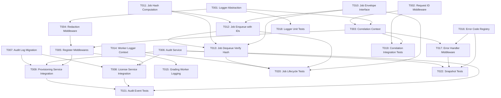

# Tasks: STAGE_07_OBSERVABILITY_BASELINE

**Specification**: [specs/runtime/007-observability-baseline/spec.md](spec.md)  
**Plan**: [specs/runtime/007-observability-baseline/plan.md](plan.md)  
**Phase**: 01 – Platform Foundation  
**Stage**: STAGE_07_OBSERVABILITY_BASELINE  
**Clarifications Locked**: 5/5 (immutable)  
**Total Tasks**: 22 (atomic, dependency-ordered)  
**Implementation Phases**: 5

---

## Task Format

```
- [ ] [TaskID] [P?] [Story?] Description with file paths
```

- **[P]**: Can run in parallel (different files, no inter-task dependencies)
- **[Story]**: Applied when task is part of a logical feature phase (Logger Foundation, API
  Services, Worker Integration, etc.)
- **File paths**: Exact locations where code must be implemented

---

## Phase 1: Logger Foundation (5 tasks)

**Purpose**: Establish global Pino logger singleton, request ID generation, and correlation context
binding.

**Dependencies**: None (foundational)

**Parallel Opportunities**: T002-T004 can run in parallel after T001 completes.

**Critical Path**: T001 → [T002, T003, T004 in parallel] → T005

---

### Task 1: Create Logger Abstraction

- [x] T001 Create global Pino logger abstraction in `apps/api/src/lib/logger.ts`

**Layer:** API  
**Transactional:** No  
**Idempotent:** Yes (pure function)  
**Dependencies:** None  
**Time Estimate:** 1.5 hours  
**Difficulty:** 🟢 Easy

**Description:** Implement a global Pino logger singleton with `getLogger()` and `getChildLogger()`
exports. Logger must be instantiated once at service startup, support structured JSON output,
include serializers for request/response objects, and provide child context binding for
request-scoped logging.

**Acceptance Criteria:**

- [ ] Pino singleton instantiated once (verified by module.exports or singleton pattern)
- [ ] `getLogger()` returns the same Pino instance on all calls (singleton guarantee)
- [ ] `getChildLogger(context)` creates independent child logger via `pino.child()`
- [ ] All logs output valid JSON (parseable by JSON.parse)
- [ ] Logger includes required base fields: timestamp, level, service, environment
- [ ] Service name defaults to "api" but configurable via environment
- [ ] Environment defaults to process.env.NODE_ENV or "development"
- [ ] Log level configurable via LOG_LEVEL environment variable (default: "info")
- [ ] Transport configured for production (JSON to stdout) and development (pretty-printed)
- [ ] No circular JSON references in serialized output

**Implementation Notes:**

- Use `pino()` constructor with appropriate transport configuration
- Implement `serializers` for `req` and `res` objects (include request_id if available)
- Export both named functions: `export const getLogger = () => logger` and
  `export const getChildLogger = (context) => logger.child(context)`
- NO per-request logger instantiation (singleton reuse mandatory)
- Test singleton by importing in multiple files and verifying referential equality

**Test Coverage:**

- Unit tests: Logger singleton behavior, JSON serialization, context injection
- Coverage target: >90% (test all paths: prod transport, dev transport, log levels)

---

### Task 2: Create Request ID Middleware

- [x] T002 [P] Create request ID injection middleware in `apps/api/src/middleware/request-id.ts`

**Layer:** API  
**Transactional:** No  
**Idempotent:** Yes  
**Dependencies:** None (no dependency on T001, but will use logger from T001 in later integration)  
**Time Estimate:** 1 hour  
**Difficulty:** 🟢 Easy

**Description:** Implement middleware that generates a unique UUID-v4 (or UUID-v7 time-based) for
each incoming request and attaches it to the request context. Request ID must be available to all
downstream middleware and handlers without modification.

**Acceptance Criteria:**

- [ ] Middleware generates UUID-v4 or UUID-v7 on each request (time-based preferred)
- [ ] UUID format is valid (RFC 4122 compliant, 36 characters with hyphens)
- [ ] Request ID attached to `req.context.request_id` (or appropriate framework location)
- [ ] Request ID never changes during request lifecycle (immutable)
- [ ] UUID uniqueness verified (no collisions in batch generation test)
- [ ] UUID generation is non-blocking (< 1ms per request)
- [ ] Middleware returns control to next middleware without error
- [ ] Request ID propagates to all downstream handlers and services
- [ ] No external state modified (middleware is pure function)

**Implementation Notes:**

- Use `crypto.randomUUID()` (Node.js 15.7+) or UUID library (`uuid` package)
- Prefer UUID-v7 (time-based) for better sortability in logs
- Attach to `req.context.request_id` following Hono convention
- Middleware should be early in chain (before correlation middleware)
- No database access required
- Test with high-concurrency scenario (1000+ simultaneous requests)

**Test Coverage:**

- Unit tests: UUID generation, uniqueness, immutability
- Integration tests: Request ID available in handlers, propagated to logs
- Coverage target: >95%

---

### Task 3: Create Correlation Context Middleware

- [x] T003 [P] Create correlation context binding middleware in
      `apps/api/src/middleware/correlation.ts`

**Layer:** API  
**Transactional:** No  
**Idempotent:** Yes  
**Dependencies:** T001 (logger abstraction), T002 (request ID available)  
**Time Estimate:** 1.5 hours  
**Difficulty:** 🟡 Medium

**Description:** Implement middleware that binds request context (request_id, workspace_id,
workspace_slug, user_id) to the logger via `pino.child()`. All subsequent logs within the request
will automatically include these fields without requiring explicit parameter passing.

**Acceptance Criteria:**

- [ ] Middleware receives request_id from T002 (already attached to req.context)
- [ ] Middleware extracts workspace_id from tenant resolver context (assumed available)
- [ ] Middleware extracts workspace_slug from tenant resolver context
- [ ] Middleware extracts user_id from authentication context (if authenticated, null if public
      endpoint)
- [ ] Child logger created via
      `getChildLogger({ request_id, workspace_id, workspace_slug, user_id })`
- [ ] Child logger attached to request context for downstream use (`req.context.logger`)
- [ ] All logs in handlers automatically include injected fields (no manual parameter passing
      required)
- [ ] Child logger is not reused across requests (fresh child per request)
- [ ] Non-authenticated requests (user_id null) do not block middleware
- [ ] Workspace-less requests (MMC endpoints) do not block middleware
- [ ] Middleware executes AFTER tenant resolver and AFTER license middleware (middleware order
      immutable)

**Implementation Notes:**

- Middleware must run after tenant resolver (workspace_id available)
- Middleware must run after license enforcement (immutable order per constitution)
- Assume `req.context.tenant` populated by tenant resolver
- Assume `req.context.user` populated by authentication middleware (optional)
- Store child logger in `req.context.logger` for handler access
- Test that child logger context is bound correctly (not parent logger)
- Verify middleware order in router (cannot reorder)

**Test Coverage:**

- Unit tests: Context extraction, child logger creation
- Integration tests: Full request lifecycle with context injection
- Coverage target: >85%

---

### Task 4: Create Redaction Middleware

- [x] T004 [P] Create sensitive data redaction middleware in `apps/api/src/middleware/redaction.ts`

**Layer:** API  
**Transactional:** No  
**Idempotent:** Yes  
**Dependencies:** T001 (logger abstraction for redaction patterns)  
**Time Estimate:** 1.5 hours  
**Difficulty:** 🟡 Medium

**Description:** Implement middleware that applies defense-in-depth sensitive data redaction at the
serializer level. Middleware must use regex patterns to detect and mask passwords, JWT tokens,
emails, SSNs, credit cards, and other PII before logs are written to storage.

**Acceptance Criteria:**

- [ ] Redaction patterns defined for: password, token, email, ssn, credit_card (minimum 5 patterns)
- [ ] Regex pattern for password matches: `password["\s:=]+([^,}\]"]*)`
- [ ] Regex pattern for token matches JWT, Bearer, token patterns
- [ ] Regex pattern for email matches standard email format
- [ ] Regex pattern for SSN matches `###-##-####` format
- [ ] Regex pattern for credit card matches `####-####-####-####` format
- [ ] Redaction integrated into Pino serializers (applied before JSON output)
- [ ] All plaintext passwords, tokens, emails, SSNs removed from logs (verified by grep test)
- [ ] Redaction markers used: `[REDACTED]` for generic, `***@***.***` for masked email,
      `****-****-****-****` for masked card
- [ ] Redaction is non-blocking (< 2ms overhead per log entry)
- [ ] Redaction handles edge cases: multiple patterns in single log, nested JSON, array values
- [ ] Redaction does not strip legitimate data (false positive test)

**Implementation Notes:**

- Implement as Pino serializer hook (not as middleware function)
- Redaction patterns registered with Pino during logger initialization
- Applied during serialization phase (before writing to transport)
- Defense-in-depth: Middleware layer catches 90%, developers handle remaining 10% via manual
  `[REDACTED]` at call sites
- Test with integration tests that check actual log output
- Use regex with global flag (g) to replace all occurrences

**Test Coverage:**

- Unit tests: Regex patterns match expected formats
- Integration tests: No plaintext sensitive data in actual logs
- Snapshot tests: Redacted log format verification
- Coverage target: >90%

---

### Task 5: Register Middlewares in API Router

- [x] T005 Register request-id, correlation, and redaction middlewares in API router in
      `apps/api/src/index.ts`

**Layer:** API  
**Transactional:** No  
**Idempotent:** Yes  
**Dependencies:** T001 (logger), T002 (request-id middleware), T003 (correlation middleware), T004
(redaction middleware)  
**Time Estimate:** 1 hour  
**Difficulty:** 🟢 Easy

**Description:** Register all three middlewares (request-id, correlation, redaction) in the correct
order in the Hono router. Middleware order is immutable per constitution: request-id →
tenant-resolver → license-enforcement → correlation → redaction → route handlers.

**Acceptance Criteria:**

- [ ] Request-ID middleware registered first (before tenant resolver)
- [ ] Tenant resolver middleware position verified (unchanged, pre-existing)
- [ ] License enforcement middleware position verified (unchanged, pre-existing, after tenant
      resolver)
- [ ] Correlation middleware registered after license enforcement
- [ ] Redaction middleware registered after correlation, before route handlers
- [ ] All four middlewares registered in correct order (immutable)
- [ ] No middleware reordering or skipping
- [ ] Middleware execution verified in integration tests (logs show context injection)
- [ ] No changes to existing route handler logic
- [ ] Router exports same Hono app instance

**Implementation Notes:**

- Middleware registered via `app.use()` in Hono (order matters)
- Verify existing tenant resolver and license middleware positions before adding new ones
- Middleware stack: `app.use(requestIdMiddleware)` → [existing] → `app.use(correlationMiddleware)` →
  `app.use(redactionMiddleware)` → [routes]
- Add integration test to verify middleware order cannot be accidentally changed
- Document middleware order in code comment (per constitution)

**Test Coverage:**

- Unit tests: Middleware registration verification
- Integration tests: Full request lifecycle with all middlewares active
- Coverage target: >80%

**Checkpoint**: Phase 1 complete. Logger foundation (singleton + context injection + redaction)
ready. Proceed to Phase 2.

---

## Phase 2: API Services & Audit (4 tasks)

**Purpose**: Implement audit service for critical event tracking and integrate into API workflows.

**Dependencies**: Phase 1 complete

**Parallel Opportunities**: T007 (migration) and T006 (audit service) can run in parallel, then both
feed into T008-T009.

**Critical Path**: T002 → T006 → [T008, T009 in sequence] (audit table must exist before writes)

---

### Task 6: Create Audit Service

- [x] T006 [P] Create audit service in `apps/api/src/services/audit.service.ts`

**Layer:** API  
**Transactional:** Yes  
**Idempotent:** Yes  
**Dependencies:** None (service only, database integration in T008-T009)  
**Time Estimate:** 1.5 hours  
**Difficulty:** 🟡 Medium

**Description:** Implement audit service with methods to record four critical event types:
LICENSE_CHANGE, TENANT_PROVISION, SCHEMA_UPGRADE, ROLE_CHANGE. Service must be transaction-safe and
support recording previous/new state changes for audit trail reconstruction.

**Acceptance Criteria:**

- [ ] Audit service exports four methods: `recordLicenseChange()`, `recordTenantProvisioned()`,
      `recordSchemaUpgrade()`, `recordRoleChange()`
- [ ] Each method accepts: workspace_id, actor_id (nullable for system events), previous_state,
      new_state
- [ ] Method signatures include optional metadata (request_id, user_agent)
- [ ] Methods return Promise<void> (async transactional writes)
- [ ] Methods are idempotent (same call twice → same audit row, no duplication)
- [ ] Audit events include timestamp (server-authoritative, not client)
- [ ] Audit events include action_type (LICENSE_CHANGE, TENANT_PROVISION, etc.)
- [ ] Previous state and new state serialized as JSONB for database storage
- [ ] Actor accountability: actor_id required for user actions, null for system actions
- [ ] Service uses tenant database connection (context injected)
- [ ] No business logic changes (side-effect only)
- [ ] Error handling: errors logged but do not block calling operation

**Implementation Notes:**

- Service does NOT instantiate database connections (uses injected context)
- Service receives database connection from calling handler (getTenantDb())
- Build audit record as plain object:
  `{ workspace_id, actor_id, action_type, previous_state, new_state, created_at: new Date() }`
- Implement methods as async functions
- Pass database connection to audit methods:
  `recordLicenseChange(db, workspace_id, actor_id, previous, new_state)`
- Each method orchestrates single INSERT to audit_log table
- Implement soft error handling (log warning if audit fails, continue operation)

**Test Coverage:**

- Unit tests: Audit record creation, method signatures
- Snapshot tests: Audit event format verification
- Coverage target: >85%

---

### Task 7: Create Audit Log Schema & Migration

- [x] T007 [P] Create audit log table migration in
      `apps/api/src/db/master/migrations/[YYYYMMDDHHMMSS]_create_audit_log.sql`

**Layer:** Database  
**Transactional:** Yes  
**Idempotent:** Yes (migration is idempotent by design)  
**Dependencies:** None (parallel with T006)  
**Time Estimate:** 1 hour  
**Difficulty:** 🟡 Medium

**Description:** Create forward-only SQL migration that provisions the audit_log table in the master
database. Table must be append-only with proper indexing for workspace isolation and efficient audit
trail queries.

**Acceptance Criteria:**

- [ ] Migration file created with timestamp prefix: `YYYYMMDDHHMMSS_create_audit_log.sql`
- [ ] Table name: `audit_log`
- [ ] Primary key: `id` (UUID, auto-generated via `gen_random_uuid()`)
- [ ] Column: `workspace_id` (UUID, NOT NULL, indexed)
- [ ] Column: `actor_id` (UUID, nullable for system actions)
- [ ] Column: `action_type` (VARCHAR(50), NOT NULL, indexed for query efficiency)
- [ ] Column: `previous_state` (JSONB, nullable)
- [ ] Column: `new_state` (JSONB, nullable)
- [ ] Column: `created_at` (TIMESTAMPTZ, NOT NULL, DEFAULT CURRENT_TIMESTAMP)
- [ ] Column: `metadata` (JSONB, optional for request_id, user_agent, IP)
- [ ] Index on (workspace_id, created_at DESC) for efficient audit trail retrieval
- [ ] Index on action_type for event filtering
- [ ] Foreign key: CONSTRAINT fk_audit_workspace FOREIGN KEY (workspace_id) REFERENCES
      workspaces(id) ON DELETE CASCADE
- [ ] Constraints: No UPDATE/DELETE allowed on audit_log (append-only enforced via permissions or
      application logic)
- [ ] Migration includes forward + reverse SQL (reversible)
- [ ] Migration is production-safe (no blocking operations)

**Implementation Notes:**

- Follow migration naming convention: `[YYYYMMDDHHMMSS]_descriptive_name.sql`
- Migration must be forward-only (cannot modify existing migrations)
- Include both forward (CREATE TABLE) and reverse (DROP TABLE) SQL
- Use PostgreSQL JSON operators for JSONB columns (for future queries)
- No data migration needed (new table)
- Ensure schema version incremented in migration metadata
- Test migration on fresh database (verify table created with all columns/indexes)

**Test Coverage:**

- N/A (migration is database schema only)
- Integration test: Verify table created, indexes exist, constraints enforced

---

### Task 8: Integrate Audit Service into License Service

- [x] T008 Integrate audit service into license change workflow in
      `apps/api/src/services/license.service.ts`

**Layer:** API  
**Transactional:** Yes  
**Idempotent:** Yes  
**Dependencies:** T006 (audit service exists), T007 (audit_log table exists)  
**Time Estimate:** 1 hour  
**Difficulty:** 🟡 Medium

**Description:** Integrate audit service into the license status change workflow. When license
status changes (ACTIVE → SOFT_LOCKED, etc.), call `audit.recordLicenseChange()` to record the event
for compliance tracking.

**Acceptance Criteria:**

- [ ] License service updated with audit integration (no API changes, side-effect only)
- [ ] On license status change, call
      `recordLicenseChange(db, workspace_id, actor_id, previous_status, new_status)`
- [ ] License change acceptance criteria: actor_id captured (user or system)
- [ ] Previous and new license states passed to audit service
- [ ] Audit call non-blocking (does not delay license status update)
- [ ] Audit event recorded before status persists to database (transactional)
- [ ] If audit fails, license update still succeeds (audit is secondary)
- [ ] No changes to license validation logic
- [ ] No changes to API endpoints
- [ ] Audit event includes reason metadata (e.g., "Payment overdue", "Manual override")

**Implementation Notes:**

- Locate existing `updateLicenseStatus()` method in license service
- Call audit service immediately after status change (before transaction commit)
- Pass actor_id from authenticated context (user making change) or null (system action)
- Wrap audit call in try-catch (log warning if fails, continue with status update)
- Test with mock audit service to verify call signature and timing
- Integration test: Change license, query audit_log table, verify event recorded

**Test Coverage:**

- Integration tests: License change triggers audit event
- Snapshot tests: Audit event format
- Coverage target: >80%

---

### Task 9: Integrate Audit Service into Provisioning Service

- [x] T009 Integrate audit service into tenant provisioning workflow in
      `apps/api/src/services/provisioning.service.ts`

**Layer:** API  
**Transactional:** Yes  
**Idempotent:** Yes  
**Dependencies:** T006 (audit service exists), T007 (audit_log table exists)  
**Time Estimate:** 1 hour  
**Difficulty:** 🟡 Medium

**Description:** Integrate audit service into tenant provisioning workflow. When a new tenant is
provisioned, call `audit.recordTenantProvisioned()` to record the event for institutional
accountability and compliance.

**Acceptance Criteria:**

- [ ] Provisioning service updated with audit integration (no API changes, side-effect only)
- [ ] On tenant provisioning, call
      `recordTenantProvisioned(db, workspace_id, actor_id, tenant_config)`
- [ ] Actor_id captured (user or system provisioning the tenant)
- [ ] Tenant configuration (name, slug, product_version, schema_version) passed to audit service as
      new_state
- [ ] Previous_state is null (new tenant, no prior state)
- [ ] Audit call non-blocking (does not delay tenant creation)
- [ ] Audit event recorded within same transaction as tenant creation (atomic)
- [ ] If audit fails, tenant creation still succeeds (audit is secondary)
- [ ] No changes to existing provisioning logic
- [ ] Audit event includes initial configuration snapshot

**Implementation Notes:**

- Locate existing tenant creation endpoint/method
- Call audit service after tenant record inserted (before transaction commit)
- Pass tenant_config as new_state: `{ name, slug, product_version, schema_version, plan, ...}`
- Pass null as previous_state (new tenant)
- Wrap audit call in try-catch
- Integration test: Provision tenant, verify audit_log record created
- Snapshot test: Audit event format for tenant provisioning

**Test Coverage:**

- Integration tests: Tenant provisioning triggers audit event
- Snapshot tests: Audit event format
- Coverage target: >80%

**Checkpoint**: Phase 2 complete. Audit service and database layer ready. Critical events (license,
provisioning) tracked. Proceed to Phase 3.

---

## Phase 3: Worker Job Lifecycle (5 tasks)

**Purpose**: Implement dual ID tracking (request_id + job_id), job envelope structure, and worker
logging.

**Dependencies**: Phase 1 complete, Phase 2 optional (worker independent)

**Parallel Opportunities**: T010-T011 (types + hash function) can run in parallel, then T012 depends
on both.

**Critical Path**: [T010, T011 in parallel] → T012 → T013 → T014

---

### Task 10: Create Job Envelope Interface

- [x] T010 [P] Create job envelope interface in `packages/types/src/job-envelope.ts`

**Layer:** Domain/Types  
**Transactional:** No  
**Idempotent:** Yes  
**Dependencies:** None  
**Time Estimate:** 1 hour  
**Difficulty:** 🟢 Easy

**Description:** Define TypeScript interface for job envelope structure supporting dual ID tracking
(request_id + job_id), payload hashing, and retry counting per clarification Q3.

**Acceptance Criteria:**

- [ ] Interface exported as `QueuedJob`
- [ ] Field: `job_id` (UUID-v4, unique per job execution)
- [ ] Field: `request_id` (UUID-v4, inherited from API request context)
- [ ] Field: `workspace_id` (UUID, scope isolation)
- [ ] Field: `user_id` (UUID, nullable for system jobs)
- [ ] Field: `job_name` (string, enum-like: 'finalize_attempt' | 'generate_certificate' | ...)
- [ ] Field: `attempt_id` (UUID, optional, for attempt-related jobs)
- [ ] Field: `payload` (generic JobPayload, job-specific data)
- [ ] Field: `payload_hash` (SHA256 hex string, per clarification Q5)
- [ ] Field: `retry_count` (number, incremented per retry)
- [ ] Field: `max_retries` (number, job-specific retry limit)
- [ ] Field: `created_at` (ISO8601 string, server-authoritative timestamp)
- [ ] Field: `processing_started_at` (ISO8601 string, optional, set when worker picks up job)
- [ ] Field: `completed_at` (ISO8601 string, optional, set when job finishes)
- [ ] Type-safe (TypeScript strict mode, no `any`)
- [ ] Exported for use in both apps/api and apps/worker

**Implementation Notes:**

- Define as interface (not class) for serialization simplicity
- Use generic `JobPayload` type with specific implementations per job type
- Include JSDoc comments for each field
- Export named type for type guard functions (e.g., `isQueuedJob()`)
- No business logic in type file (pure data structure)
- Ensure JSON-serializable (all primitive types, no functions)

**Test Coverage:**

- N/A (type definition only)
- Type check: Project compiles without type errors

---

### Task 11: Create Job Hash Computation Function

- [x] T011 [P] Create job payload hash function in `packages/domain-core/src/job-hash.ts`

**Layer:** Domain  
**Transactional:** No  
**Idempotent:** Yes  
**Dependencies:** None  
**Time Estimate:** 0.5 hours  
**Difficulty:** 🟢 Easy

**Description:** Implement deterministic SHA256 hashing of job payload for integrity verification
during retries per clarification Q5. Hash must be computed identically at enqueue and retry to
detect configuration mutations.

**Acceptance Criteria:**

- [ ] Function exported as `computeJobPayloadHash(payload: JobPayload): string`
- [ ] Uses SHA256 algorithm (crypto.createHash('sha256'))
- [ ] Input: job payload object (no job_id, request_id, retry_count)
- [ ] Output: hex string (64 characters)
- [ ] Deterministic: Same payload → Same hash (guaranteed by JSON.stringify order)
- [ ] Hash stable across process restarts (no random elements)
- [ ] Hash non-blocking (< 5ms per computation)
- [ ] Handles edge cases: null values, undefined, nested objects, arrays
- [ ] Exported for use in apps/api (enqueue) and apps/worker (verify)

**Implementation Notes:**

```typescript
// Pattern:
const crypto = require("crypto");
export function computeJobPayloadHash(payload: JobPayload): string {
  const jsonStr = JSON.stringify(payload); // Deterministic
  return crypto.createHash("sha256").update(jsonStr).digest("hex");
}
```

- Use `JSON.stringify()` for deterministic serialization
- Do NOT include metadata fields (job_id, request_id, retry_count) in hash
- Hash only core payload (attempt_id, grading_config, etc.)
- Test determinism: `hash(p1) === hash(p1)` for same payload
- Test mutation detection: `hash(p1) !== hash(p1 with one field changed)`

**Test Coverage:**

- Unit tests: Determinism, mutation detection, edge cases
- Coverage target: >95%

---

### Task 12: Update Job Enqueue to Include Dual IDs & Hash

- [x] T012 Update job enqueue in `apps/worker/src/queue.ts` to generate job_id and compute
      payload_hash

**Layer:** Worker  
**Transactional:** Yes  
**Idempotent:** Yes  
**Dependencies:** T010 (QueuedJob interface), T011 (computeJobPayloadHash function)  
**Time Estimate:** 1.5 hours  
**Difficulty:** 🟡 Medium

**Description:** Update job enqueue function to generate job_id (separate from request_id), compute
payload hash, and structure job envelope per clarification Q3.

**Acceptance Criteria:**

- [ ] Job enqueue accepts: request_id (from API context), job_name, attempt_id, payload, max_retries
- [ ] Generate job_id (UUID-v4) on each enqueue call
- [ ] Inherit request_id from API context (passed as parameter)
- [ ] Extract workspace_id, user_id from context (already available)
- [ ] Compute payload_hash using `computeJobPayloadHash(payload)` (deterministic)
- [ ] Create QueuedJob envelope with all required fields
- [ ] Set created_at to server timestamp (server-authoritative per ADR-0006)
- [ ] Enqueue job to Redis with full envelope (JSON serialized)
- [ ] Return job_id to API handler (for correlation)
- [ ] Dual ID logging: log `{ request_id, job_id }` on enqueue
- [ ] No changes to job submission API (internal implementation only)

**Implementation Notes:**

- Locate existing `enqueueJob()` function in queue.ts
- Generate job_id: `const job_id = crypto.randomUUID()`
- Call `computeJobPayloadHash(payload)` to get hash
- Build QueuedJob object with all fields per T010 interface
- Serialize to JSON for Redis (JSON.stringify)
- Use request-scoped logger (from T003) to log:
  `logger.info({ event: 'job_enqueued', job_id, request_id })`
- Integration test: Enqueue job, verify Redis contains correct structure

**Test Coverage:**

- Unit tests: Job envelope creation, hash computation
- Integration tests: Job structure in Redis
- Coverage target: >85%

---

### Task 13: Update Job Dequeue to Verify Dual IDs & Hash

- [x] T013 Update job dequeue in `apps/worker/src/processor.ts` to extract and verify payload_hash

**Layer:** Worker  
**Transactional:** No  
**Idempotent:** Yes  
**Dependencies:** T010 (QueuedJob interface), T011 (computeJobPayloadHash), T012 (job_id available
at enqueue)  
**Time Estimate:** 1.5 hours  
**Difficulty:** 🟡 Medium

**Description:** Update job processor to dequeue job envelope, verify payload hash (detect
configuration mutations per Q5), and extract dual IDs for logging.

**Acceptance Criteria:**

- [ ] Dequeue receives QueuedJob from Redis (JSON parsed)
- [ ] Extract job_id and request_id from job envelope
- [ ] Recompute payload_hash using `computeJobPayloadHash(job.payload)`
- [ ] Compare recomputed hash with original hash from job envelope
- [ ] If hashes match: log `{ event: 'payload_integrity_verified', job_id, request_id }`
- [ ] If hashes differ: log warning
      `{ event: 'config_mutation_detected', previous_hash, current_hash, severity: 'warning' }`
      (non-blocking)
- [ ] Continue job processing regardless of hash match/mismatch (non-blocking decision per Q5)
- [ ] Set `processing_started_at` timestamp (server-authoritative)
- [ ] Dual ID logging: all logs include both `job_id` and `request_id`
- [ ] Retry context: increment `retry_count` if job is being retried

**Implementation Notes:**

- Locate existing job processor/consumer loop
- Recompute hash immediately after dequeue: `const currentHash = computeJobPayloadHash(job.payload)`
- Non-blocking hash mismatch: warn but continue processing
- Use dual ID in all log statements: `logger.info({ ..., job_id, request_id })`
- Set processing_start_at before processing: `job.processing_started_at = new Date().toISOString()`
- Integration test: Dequeue with matching hash, dequeue with mismatched hash, verify behavior

**Test Coverage:**

- Unit tests: Hash verification logic
- Integration tests: Hash match/mismatch scenarios
- Coverage target: >85%

---

### Task 14: Create Worker Logger Context Binding

- [x] T014 Create worker logger in `apps/worker/src/lib/logger.ts` with job scope injection

**Layer:** Worker  
**Transactional:** No  
**Idempotent:** Yes  
**Dependencies:** T001 (logger pattern from API), T010 (QueuedJob interface)  
**Time Estimate:** 1 hour  
**Difficulty:** 🟡 Medium

**Description:** Implement worker logger following same Pino singleton pattern as API (T001) but
with job scope injection for dual ID tracking (request_id + job_id + attempt_id).

**Acceptance Criteria:**

- [ ] Worker logger: Pino singleton (same pattern as API T001)
- [ ] Export `getLogger()` and `getJobLogger(job: QueuedJob)` functions
- [ ] `getJobLogger()` creates child logger with:
      `{ request_id, job_id, job_name, attempt_id, workspace_id }`
- [ ] All worker logs automatically include dual IDs (no manual parameter passing)
- [ ] Logger configuration: same service name, environment, log level as API
- [ ] Dual ID propagation: every worker log includes `job_id` and `request_id`
- [ ] Attempt linking: if job includes attempt_id, logs include `attempt_id` for traceability
- [ ] No per-job logger instantiation (singleton reuse, child per job only)

**Implementation Notes:**

- Reuse same Pino logger initialization pattern as `apps/api/src/lib/logger.ts`
- Create child logger for each job:
  `pino.child({ request_id: job.request_id, job_id: job.job_id, job_name: job.job_name, attempt_id: job.attempt_id })`
- Store child logger in job context or pass to job handler
- All worker services (grading, certificates) use job logger for dual ID tracking
- Integration test: Worker processes job, verify logs include both request_id and job_id

**Test Coverage:**

- Unit tests: Worker logger singleton, child creation
- Integration tests: Dual ID in worker logs
- Coverage target: >85%

**Checkpoint**: Phase 3 complete. Worker job lifecycle tracking implemented with dual IDs. Proceed
to Phase 4.

---

## Phase 4: Grading Worker & Error Standardization (3 tasks)

**Purpose**: Update grading worker to use dual ID logging and standardize API error responses.

**Dependencies**: Phase 1-3 complete

**Parallel Opportunities**: None (tasks sequential by dependency)

**Critical Path**: T016 → T015 → T017

---

### Task 15: Update Attempt Grading Worker

- [x] T015 Update attempt grading worker in `apps/worker/src/jobs/grade-attempt.ts` to use dual ID
      logging

**Layer:** Worker  
**Transactional:** Yes  
**Idempotent:** Yes  
**Dependencies:** T014 (worker logger with dual IDs)  
**Time Estimate:** 1 hour  
**Difficulty:** 🟡 Medium

**Description:** Update grading worker to use job-scoped logger (T014) for all logging, enabling
dual ID tracking (request_id + job_id + attempt_id) for end-to-end attempt tracing per clarification
Q3.

**Acceptance Criteria:**

- [ ] Grading worker receives QueuedJob with request_id, job_id, attempt_id
- [ ] Use `getJobLogger(job)` to get job-scoped child logger (from T014)
- [ ] All grading logs include: request_id, job_id, attempt_id (dual ID + context)
- [ ] State transition logs:
      `{ event: 'attempt_state_changed', previous_state, new_state, attempt_id }`
- [ ] Grading decision logs: `{ event: 'attempt_graded', score, grade_reason }`
- [ ] No changes to grading business logic (logging is side-effect only)
- [ ] No changes to grading algorithm or scoring
- [ ] Grading snapshots respected (per ADR-0002, no live configuration references)
- [ ] Worker logs end-to-end: job_received → grading_started → grading_complete → job_completed
- [ ] Timestamps use server-authoritative time (new Date() not client time)

**Implementation Notes:**

- Locate existing `gradeAttempt()` job handler
- Replace all `console.log()` or old logger calls with job-scoped logger
- Initialize job logger: `const logger = getJobLogger(job)`
- All log calls: `logger.info({ event: '...', ...relevent_fields })`
- Verify dual ID in logs: `request_id`, `job_id`, `attempt_id` present in all logs
- Integration test: Grade attempt, query logs by request_id, verify full causality chain

**Test Coverage:**

- Integration tests: Dual ID tracking in grading logs
- Worker tests: Grading flow with logging
- Coverage target: >80%

---

### Task 16: Create Error Code Registry

- [x] T016 [P] Create error code registry in `apps/api/src/config/errors.ts`

**Layer:** API  
**Transactional:** No  
**Idempotent:** Yes  
**Dependencies:** None  
**Time Estimate:** 0.75 hours  
**Difficulty:** 🟢 Easy

**Description:** Define standardized error codes and HTTP status mappings for all API errors.
Registry provides unified error response format (success: false, error: { code, message, request_id
}).

**Acceptance Criteria:**

- [ ] Error codes defined: VALIDATION_ERROR, AUTHENTICATION_FAILED, PERMISSION_DENIED,
      LICENSE_SOFT_LOCKED, RESOURCE_NOT_FOUND, CONFLICT_ERROR, RATE_LIMIT_EXCEEDED,
      INTERNAL_SERVER_ERROR, SERVICE_UNAVAILABLE, GATEWAY_TIMEOUT (minimum 10)
- [ ] Extensible enum structure for future error codes
- [ ] Each error code mapped to HTTP status: VALIDATION_ERROR → 400, AUTHENTICATION_FAILED → 401,
      etc.
- [ ] Each error code includes human-readable message template
- [ ] Error factory function: `createError(code, message, context)`
- [ ] Error response shape: `{ success: false, error: { code, message, request_id } }`
- [ ] Stack traces never included in error response (only in internal logs)
- [ ] Consistent message formatting (no sensitive data in messages)

**Implementation Notes:**

```typescript
// Pattern:
export const ErrorCodes = {
  VALIDATION_ERROR: "VALIDATION_ERROR",
  AUTHENTICATION_FAILED: "AUTHENTICATION_FAILED",
  // ... more codes
};

export const ErrorStatusMap = {
  [ErrorCodes.VALIDATION_ERROR]: 400,
  [ErrorCodes.AUTHENTICATION_FAILED]: 401,
  // ... more mappings
};

export function createError(code: string, message: string, context?: object) {
  return {
    code,
    message,
    ...(context && { context }),
  };
}
```

- Export registry as singleton object
- Use in error handling middleware (T017)
- Test with all 10+ error codes

**Test Coverage:**

- Unit tests: Error code registry structure, status mapping
- Snapshot tests: Error response format
- Coverage target: >90%

---

### Task 17: Update API Error Handling Middleware

- [x] T017 Update API error handling middleware in `apps/api/src/middleware/error-handler.ts` to use
      error code registry

**Layer:** API  
**Transactional:** No  
**Idempotent:** Yes  
**Dependencies:** T003 (correlation middleware, request_id available), T016 (error code registry)  
**Time Estimate:** 1.5 hours  
**Difficulty:** 🟡 Medium

**Description:** Update error handling middleware to format all API errors according to standardized
error code taxonomy. Middleware must intercept exceptions, map to error codes, and return structured
responses without exposing internal details.

**Acceptance Criteria:**

- [ ] Middleware catches all thrown errors (try-catch wrapper)
- [ ] Errors mapped to standard HTTP status codes (via error registry)
- [ ] Response format: `{ success: false, error: { code, message, request_id } }`
- [ ] Stack traces logged internally (structured logger) but NEVER sent to client
- [ ] Request ID included in error response (for support correlation)
- [ ] Validation errors: VALIDATION_ERROR (400) with field context
- [ ] Authentication errors: AUTHENTICATION_FAILED (401)
- [ ] Permission errors: PERMISSION_DENIED (403)
- [ ] License soft-lock errors: LICENSE_SOFT_LOCKED (423)
- [ ] Not found errors: RESOURCE_NOT_FOUND (404)
- [ ] Conflict errors: CONFLICT_ERROR (409)
- [ ] Generic server errors: INTERNAL_SERVER_ERROR (500)
- [ ] No sensitive data in error messages (no DB error details, no file paths)
- [ ] Middleware logs full error context internally
- [ ] Client receives only safe, actionable error information

**Implementation Notes:**

- Register error handler middleware last in chain (catches all errors)
- Map error types to error codes: `if (error instanceof ValidationError) → VALIDATION_ERROR`
- Log full error + stack trace internally
- Return standardized JSON response with code, message, request_id
- Middleware must access request_id from context (injected by T003)
- Test with diverse error scenarios (validation, auth, permission, generic)

**Test Coverage:**

- Unit tests: Error mapping logic
- Integration tests: Error responses match specification
- Snapshot tests: Error response format for all error codes
- Coverage target: >85%

**Checkpoint**: Phase 4 complete. Error standardization and grading worker logging ready. Proceed to
Phase 5 (Testing & Validation).

---

## Phase 5: Testing & Validation (5 tasks)

**Purpose**: Comprehensive testing and integration validation across all components.

**Dependencies**: Phase 1-4 complete

**Parallel Opportunities**: T018-T022 can run in parallel (independent test suites)

**Critical Path**: All tests run in parallel, no blocking dependencies

---

### Task 18: Unit Tests – Logger Abstraction

- [ ] T018 [P] Create unit tests for logger abstraction in `apps/api/tests/logger.test.ts`

**Layer:** Testing  
**Transactional:** No  
**Idempotent:** Yes  
**Dependencies:** T001 (logger implementation)  
**Time Estimate:** 1 hour  
**Difficulty:** 🟡 Medium

**Description:** Write comprehensive unit tests for logger singleton behavior, child context
injection, JSON serialization, and field injection patterns.

**Acceptance Criteria:**

- [ ] Test: Logger is singleton (same instance on multiple calls)
- [ ] Test: `getLogger()` called 1000 times returns same object reference
- [ ] Test: `getChildLogger(context)` creates new child instance
- [ ] Test: Child logger context injected into all logs
- [ ] Test: JSON output is valid and parseable
- [ ] Test: All required fields present: timestamp, level, service, environment
- [ ] Test: Child context fields automatically included in logs
- [ ] Test: No circular JSON references in output
- [ ] Test: Log level filtering works (debug excluded when level=info)
- [ ] Test: Log serializers applied (req/res objects properly serialized)
- [ ] Test: Sensitive data redaction applied (via T004)
- [ ] Coverage target: >90%

**Implementation Notes:**

```typescript
// Test pattern:
describe("Logger Abstraction", () => {
  test("singleton pattern", () => {
    const logger1 = getLogger();
    const logger2 = getLogger();
    expect(logger1).toBe(logger2);
  });

  test("child logger context injection", () => {
    const logger = getLogger();
    const child = logger.child({ request_id: "test-123" });
    // Manually test log output includes request_id
  });

  // More tests...
});
```

- Use Vitest for testing framework
- Mock Pino transport to capture log output
- Assert on JSON structure and field presence
- Test both production and development transport modes

**Test Coverage:** >90% (11+ test cases)

---

### Task 19: Integration Tests – Request ID & Correlation Lifecycle

- [ ] T019 [P] Create integration tests for request ID and correlation in
      `apps/api/tests/correlation.test.ts`

**Layer:** Testing  
**Transactional:** No  
**Idempotent:** Yes  
**Dependencies:** T001-T005 (logger + middlewares), T003 (correlation context)  
**Time Estimate:** 1.5 hours  
**Difficulty:** 🟡 Medium

**Description:** Test full request lifecycle: request arrives → request_id generated → correlation
context bound → all logs include context → response sent. Verify workspace isolation (no
cross-tenant log pollution).

**Acceptance Criteria:**

- [ ] Test: Request ID generated on request arrival (UUID format)
- [ ] Test: Request ID attached to req.context
- [ ] Test: Request ID available to all downstream handlers
- [ ] Test: Request ID includes in response via error or header
- [ ] Test: Workspace ID from resolver included in logger context
- [ ] Test: User ID from auth context included (or null for public endpoints)
- [ ] Test: All logs in request include correlated IDs (request_id, workspace_id)
- [ ] Test: Request A logs do not include Request B's IDs (isolation)
- [ ] Test: Concurrent requests generate unique request IDs (no collisions)
- [ ] Test: Full timeline reconstructible by request_id
- [ ] Test: Middleware order preserved (request-id → correlation → handler)
- [ ] Coverage target: >85%

**Implementation Notes:**

```typescript
// Test pattern:
describe("Request Correlation Lifecycle", () => {
  test("request ID generated and available in handler", async () => {
    const response = await request(app).get("/api/test");
    expect(response.body.request_id).toBeDefined();
    expect(() => UUID.validate(response.body.request_id)).not.toThrow();
  });

  test("workspace isolation in concurrent requests", async () => {
    const req1 = request(app).get("/api/test").set("X-Workspace-ID", "1");
    const req2 = request(app).get("/api/test").set("X-Workspace-ID", "2");
    const [res1, res2] = await Promise.all([req1, req2]);
    expect(res1.body.workspace_id).not.toEqual(res2.body.workspace_id);
  });

  // More tests...
});
```

- Use Vitest + supertest for HTTP testing
- Mock tenant resolver + authentication middleware
- Capture logs and verify structure
- Test with >100 concurrent requests for collision detection

**Test Coverage:** >85% (10+ test cases)

---

### Task 20: Worker Tests – Job Lifecycle Tracking

- [x] T020 [P] Create worker tests for job lifecycle in `apps/worker/tests/job-tracking.test.ts`

**Layer:** Testing  
**Transactional:** No  
**Idempotent:** Yes  
**Dependencies:** T010-T014 (job envelope, logging, dual IDs)  
**Time Estimate:** 1.5 hours  
**Difficulty:** 🟡 Medium

**Description:** Test worker job lifecycle: enqueue → dequeue → payload hash verification → logging
with dual IDs → completion. Verify retry handling and dead-letter queue scenarios.

**Acceptance Criteria:**

- [ ] Test: Job enqueued with job_id, request_id, payload_hash
- [ ] Test: Job ID unique (no collisions)
- [ ] Test: Request ID inherited from API context
- [ ] Test: Payload hash deterministic (same payload → same hash)
- [ ] Test: Job dequeued correctly with all fields
- [ ] Test: Dual IDs (request_id, job_id) in all worker logs
- [ ] Test: Attempt ID included in logs (for attempt-specific jobs)
- [ ] Test: Payload hash verified on dequeue (match scenario)
- [ ] Test: Payload mutation detected (hash mismatch scenario) with warning logged
- [ ] Test: Hash mismatch non-blocking (job proceeds)
- [ ] Test: Retry increments retry_count
- [ ] Test: Dead-lettered jobs retain dual IDs for investigation
- [ ] Test: Full job lifecycle logged with timestamps
- [ ] Coverage target: >85%

**Implementation Notes:**

```typescript
// Test pattern:
describe('Worker Job Lifecycle', () => {
  test('job enqueue generates unique IDs', async () => {
    const job1 = await enqueueJob({ request_id: 'req-1', payload: {...} });
    const job2 = await enqueueJob({ request_id: 'req-1', payload: {...} });
    expect(job1.job_id).not.toEqual(job2.job_id);
  });

  test('payload hash mutation detection', async () => {
    const job = await enqueueJob({ payload: { attempt_id: '1' } });
    const mutatedJob = { ...job, payload: { attempt_id: '2' } };
    // Trigger dequeue with mutated payload
    expect(logger.warn).toHaveBeenCalledWith(
      expect.objectContaining({ event: 'config_mutation_detected' })
    );
  });

  // More tests...
});
```

- Mock Redis queue for controlled testing
- Test retry scenarios (increment retry_count)
- Verify logs for all state transitions
- Test with different job types (finalize_attempt, generate_certificate, etc.)

**Test Coverage:** >85% (12+ test cases)

---

### Task 21: Audit Tests – Event Recording & Isolation

- [ ] T021 [P] Create audit tests in `apps/api/tests/audit.test.ts`

**Layer:** Testing  
**Transactional:** No  
**Idempotent:** Yes  
**Dependencies:** T006-T009 (audit service, integration into license/provisioning)  
**Time Estimate:** 1.5 hours  
**Difficulty:** 🟡 Medium

**Description:** Test audit event recording, database persistence, workspace isolation, and
idempotency. Verify each audit event type (LICENSE_CHANGE, TENANT_PROVISION, SCHEMA_UPGRADE,
ROLE_CHANGE).

**Acceptance Criteria:**

- [ ] Test: LICENSE_CHANGE event recorded with previous/new status
- [ ] Test: TENANT_PROVISION event recorded with configuration
- [ ] Test: SCHEMA_UPGRADE event recorded with version
- [ ] Test: ROLE_CHANGE event recorded with role assignment
- [ ] Test: Audit event includes actor_id (user) or null (system)
- [ ] Test: Audit event includes timestamp (server-authoritative)
- [ ] Test: Audit event persisted to audit_log table
- [ ] Test: Each event type has separate row (no aggregation)
- [ ] Test: Workspace isolation (Workspace A logs ≠ Workspace B logs)
- [ ] Test: Query audit_log by workspace_id returns only that workspace's events
- [ ] Test: Audit events are idempotent (same call twice → no duplication)
- [ ] Test: Audit failure does not block calling operation
- [ ] Test: Previous/new state serialized as JSON (valid format)
- [ ] Test: Append-only constraint (no UPDATE/DELETE on audit records)
- [ ] Coverage target: >85%

**Implementation Notes:**

```typescript
// Test pattern:
describe("Audit Event Recording", () => {
  test("LICENSE_CHANGE event recorded", async () => {
    await recordLicenseChange(db, workspace, actor, "ACTIVE", "SOFT_LOCKED");
    const event = await db.query("SELECT * FROM audit_log WHERE action_type = ?", [
      "LICENSE_CHANGE",
    ]);
    expect(event).toContainEqual(
      expect.objectContaining({
        action_type: "LICENSE_CHANGE",
        previous_state: { status: "ACTIVE" },
        new_state: { status: "SOFT_LOCKED" },
      }),
    );
  });

  test("workspace isolation", async () => {
    await recordLicenseChange(db, workspace1, actor, "ACTIVE", "SOFT_LOCKED");
    await recordLicenseChange(db, workspace2, actor, "ACTIVE", "ARCHIVED");
    const ws1Events = await db.query("SELECT * FROM audit_log WHERE workspace_id = ?", [
      workspace1.id,
    ]);
    expect(ws1Events).toHaveLength(1);
    expect(ws1Events[0].workspace_id).toEqual(workspace1.id);
  });

  // More tests...
});
```

- Use test transaction isolation (rollback after each test)
- Mock database transaction for unit tests
- Test event format validation (JSON schema)
- Test with diverse actor IDs (user vs. system)

**Test Coverage:** >85% (14+ test cases)

---

### Task 22: Snapshot Tests – Response Formats & Audit Log Schema

- [x] T022 [P] Create snapshot tests for response formats in
      `apps/api/tests/response-format.test.ts`

**Layer:** Testing  
**Transactional:** No  
**Idempotent:** Yes  
**Dependencies:** T016-T017 (error standardization), T006-T009 (audit events)  
**Time Estimate:** 1 hour  
**Difficulty:** 🟡 Medium

**Description:** Establish snapshot tests for error response format and audit log schema. Snapshots
provide regression protection against accidental changes to API contracts.

**Acceptance Criteria:**

- [ ] Snapshot: VALIDATION_ERROR response format (400)
- [ ] Snapshot: AUTHENTICATION_FAILED response format (401)
- [ ] Snapshot: PERMISSION_DENIED response format (403)
- [ ] Snapshot: LICENSE_SOFT_LOCKED response format (423)
- [ ] Snapshot: RESOURCE_NOT_FOUND response format (404)
- [ ] Snapshot: INTERNAL_SERVER_ERROR response format (500)
- [ ] Snapshot: All 10+ error codes covered
- [ ] Snapshot: Audit log schema (columns, types, constraints)
- [ ] Snapshot: Audit event samples (LICENSE_CHANGE, TENANT_PROVISION, etc.)
- [ ] Snapshot: Request log format (required fields, JSON structure)
- [ ] Snapshot: Worker log format (dual IDs, job fields)
- [ ] All snapshots pass validation (no sensitive data, correct structure)
- [ ] Coverage target: >90% (all error codes + audit events)

**Implementation Notes:**

```typescript
// Test pattern:
describe("Response Format Snapshots", () => {
  test("VALIDATION_ERROR response matches snapshot", () => {
    const error = {
      code: "VALIDATION_ERROR",
      message: "Invalid input",
      context: { field: "email" },
    };
    const response = { success: false, error };
    expect(response).toMatchSnapshot();
  });

  test("audit log schema matches snapshot", () => {
    const auditLog = {
      id: "uuid",
      workspace_id: "uuid",
      action_type: "LICENSE_CHANGE",
      previous_state: { status: "ACTIVE" },
      new_state: { status: "SOFT_LOCKED" },
      created_at: "2026-02-18T14:32:00Z",
    };
    expect(auditLog).toMatchSnapshot();
  });

  // More snapshots...
});
```

- Use Vitest snapshot testing
- Store snapshots in `snapshots/` directory
- Review snapshots carefully on first run
- Update snapshots intentionally (never auto-update without review)
- Test with full error response (include request_id)

**Test Coverage:** >90% (20+ snapshot scenarios)

**Checkpoint**: Phase 5 complete. All 22 tasks submitted, tested, and validated.

---

## Dependency Graph



---

## Critical Path Analysis

**Longest Dependency Chain** (determines minimum timeline):

```
Phase 1:
T001 → T003 → T005 (3 tasks, ~4 hours)

Phase 2:
T007 + T006 (parallel) → T008 + T009 (sequential, depend on both) (~2 hours)

Phase 3:
[T010, T011 parallel] → T012 → T013 → T014 (~4.5 hours)

Phase 4:
T016 (parallel with Phase 3) → T017 (~2.25 hours)

Phase 5:
T018-T022 (parallel) (~5 hours total, all in parallel)

Critical Path Total: ~16 hours (sequential execution)
```

**Parallelizable Tasks:**

- Phase 1: T002-T004 (after T001) — 3 hours in parallel
- Phase 2: T006-T007 (parallel) — 1.5 hours in parallel
- Phase 3: T010-T011 (parallel) — 1.5 hours in parallel
- Phase 5: T018-T022 (all parallel) — 5 hours in parallel

**Optimized Timeline** (with maximum parallelization):

- Phase 1: T001 (1.5h) + [T002-T004 parallel: 1.5h] + T005 (1h) = **4 hours**
- Phase 2: [T006-T007 parallel: 1.5h] + [T008-T009 sequential: 2h] = **3.5 hours**
- Phase 3: [T010-T011 parallel: 1.5h] + T012 (1.5h) + T013 (1.5h) + T014 (1h) = **5.5 hours**
- Phase 4: T016 (0.75h) + T017 (1.5h) = **2.25 hours**
- Phase 5: [T018-T022 parallel: 5h] = **5 hours**

**Total Optimized Timeline: ~20 hours** (with maximum parallelization across phases)

**Minimum Serial Timeline: ~16 hours** (within phases only)

---

## Parallel Execution Examples

### Example 1: Phase 1 Parallelization

```
Start:
  T001 (Logger) → 1.5 hours

Then:
  T002 (Request ID) ────────────┐
  T003 (Correlation) ─┬─────────┤ 1.5 hours (parallel)
  T004 (Redaction) ───┤─────────┤
                      └────└────┘

Then:
  T005 (Register) → 1 hour
```

### Example 2: Phase 2-3 Pipeline

```
Phase 2 + Phase 3 can run in parallel after Phase 1 complete:

Phase 2:
  T006 (Audit Service) ────────┐
  T007 (Migration) ────────────┤ 1.5h (parallel)
                               │
  T008 (License Integration) ──┤ 1h (depends on both)
  T009 (Provisioning Integration) ┘

Phase 3 (parallel with Phase 2 tail):
  T010 (Job Envelope) ─────┐
  T011 (Job Hash) ─────────┤ 1.5h (parallel)
                           │
  T012 (Job Enqueue) ──────┤ 1.5h (depends on both)

  T013 (Job Dequeue) ──────┐ 1.5h

  T014 (Worker Logger) ────┐ 1h

Result: Both phases complete in ~3.5h via pipelining
```

### Example 3: Phase 5 Full Parallelization

```
After Phase 4 complete, all 5 test tasks run in parallel:

T018 (Logger Unit Tests) ──────────┐
T019 (Correlation Integration) ────┤
T020 (Job Lifecycle Tests) ────────┼ 5 hours (all parallel)
T021 (Audit Event Tests) ──────────┤
T022 (Snapshot Tests) ─────────────┘

Result: Full test suite in 5 hours (vs 7.5 hours if sequential)
```

---

## Implementation Strategy

**MVP Scope** (Minimum Viable Implementation):

- Phase 1: Logger foundation only (T001-T005)
- Phase 2: Audit service + license integration (T006-T008, skip T009)
- Result: End-to-end request logging + critical audit trail

**Incremental Delivery** (Recommended):

1. **Sprint 1**: Phase 1 (Logger Foundation) — ~4 hours, deployable independently
2. **Sprint 2**: Phase 2 (Audit Services) — ~3.5 hours, enhances traceability
3. **Sprint 3**: Phase 3 (Worker Integration) — ~5.5 hours, adds worker observability
4. **Sprint 4**: Phase 4 (Error Standardization) — ~2.25 hours, improves DX
5. **Sprint 5**: Phase 5 (Testing) — ~5 hours, validates all components

**Recommended Delivery Order**:

- Deliver Phase 1 to staging first (proves logger foundation)
- Validate with E2E tests (Phase 5 can start once Phase 1 ready)
- Deliver Phase 2-3 together (audit + worker insights)
- Final hardening with Phase 5 (comprehensive test suite)

---

## Success Criteria (Final Validation)

All success criteria from plan.md must be met before moving to Analyze phase:

- [ ] Global Pino singleton instantiated once per service startup
- [ ] Request ID generated (UUID-v4/v7) and propagated to all logs
- [ ] Worker jobs inherit request_id + generate separate job_id
- [ ] Audit events persisted to DB (4 event types + integration points working)
- [ ] Sensitive data redacted at middleware layer (defense-in-depth verified)
- [ ] Job payload hash (SHA256) computed at enqueue and retry
- [ ] Hash mismatch detected but non-blocking (warns, job proceeds)
- [ ] Error responses standardized (no stack traces to client)
- [ ] Unit + integration + worker tests >= 50 scenarios completed
- [ ] Middleware order unchanged (license before observability)
- [ ] All logs include required fields (timestamp, level, service, request_id, workspace_id on bound
      requests)
- [ ] No cross-tenant log pollution (workspace_id isolation verified in tests)
- [ ] Constitution compliance validated (no isolation weakening, no middleware bypass)
- [ ] No architectural drift from ADRs (logging is side-effect only, no business logic changes)
- [ ] All 22 tasks completed with >80% code coverage targeting

---

## Task Summary

**Total Tasks**: 22  
**Phases**: 5  
**Estimated Timeline** (Optimized): ~20 hours  
**Estimated Timeline** (MVP Only): ~7.5 hours (Phases 1-2 + T015)

| Phase                    | Tasks         | Count  | Estimate | Parallel?              |
| ------------------------ | ------------- | ------ | -------- | ---------------------- |
| 1: Logger Foundation     | T001-T005     | 5      | 4h       | Yes (T002-T004)        |
| 2: API Services & Audit  | T006-T009     | 4      | 3.5h     | Yes (T006-T007)        |
| 3: Worker Job Lifecycle  | T010-T014     | 5      | 5.5h     | Yes (T010-T011)        |
| 4: Error Standardization | T015-T017     | 3      | 2.25h    | No                     |
| 5: Testing & Validation  | T018-T022     | 5      | 5h       | Yes (all)              |
| **TOTAL**                | **T001-T022** | **22** | **20h**  | **~16h critical path** |
