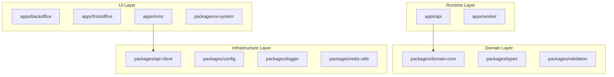

# Data Model: STAGE_INFRA_08_ARCHITECTURE_VISUALIZATION

**Stage**: `STAGE_INFRA_08_ARCHITECTURE_VISUALIZATION`  
**Phase**: `01_PLATFORM_FOUNDATION`  
**Data Model Generated**: 2026-03-09  
**Source**: Derived from `research.md`, `spec.md` (FR section), and inspection of
`docs/architecture/graphs/dependency-graph.json` and
`docs/architecture/intelligence/ARCHITECTURE_MAP.json`

---

## 1. Input Data Structures

These interfaces describe the shape of data the script **reads** from disk.

### 1.1 `DependencyGraph`

```typescript
/**
 * Shape of docs/architecture/graphs/dependency-graph.json
 * Produced by: bun run arch:audit (scripts/infra-audit.ts)
 */
interface DependencyGraph {
  nodes: string[]; // Mix of top-level and deep submodule paths
  edges: Array<{
    from: string; // Source module path (may be deep submodule path)
    to: string; // Target module path (may be deep submodule path)
  }>;
}
```

**Key observations**:

- `nodes` contains both top-level paths (`apps/api`, `packages/types`) and deep submodule paths
  (`./apps/mmc/src/core/auth/token-manager`)
- `edges` contains duplicates — the same `(from, to)` pair may appear multiple times
- No metadata fields — the schema is exactly `{ nodes, edges }`

### 1.2 `ArchitectureMap`

```typescript
/**
 * Shape of docs/architecture/intelligence/ARCHITECTURE_MAP.json
 * Produced by: bun run arch:generate or bun run arch:fix
 */
interface ArchitectureMapModule {
  layer: string; // "domain" | "infrastructure" | "runtime" | "ui"
  description: string;
  criticality: string;
  allowed_dependencies: string[];
  forbidden_dependencies: string[];
}

interface ArchitectureMap {
  system: string; // "Zidney"
  architecture_model: string; // "layered-monorepo"
  version: string; // "1.0"
  layers: string[]; // ["domain", "infrastructure", "runtime", "ui"]
  modules: Record<string, ArchitectureMapModule>;
}
```

---

## 2. Processing Data Structures

These types describe intermediate state used during diagram generation.

### 2.1 `LayerMap`

```typescript
/**
 * Lookup table: module path → layer name
 * Built from ArchitectureMap.modules or heuristic classification
 * Used by all diagram generators
 *
 * Key: module path (e.g., "apps/api")
 * Value: layer name (e.g., "runtime") or "unknown" for unclassified modules
 */
type LayerMap = Map<string, string>;
```

**Construction rule**: For each top-level node, check `ArchitectureMap.modules[node].layer`. If
absent or if ArchitectureMap is null, apply `classifyLayerHeuristic(node)`. If heuristic also
returns `"unknown"`, emit a warning.

### 2.2 `Edge`

```typescript
/**
 * A deduplicated, top-level-only dependency edge
 * Both from and to are guaranteed to be in the top-level module set
 */
interface Edge {
  from: string; // Top-level module path (e.g., "apps/api")
  to: string; // Top-level module path (e.g., "packages/domain-core")
}
```

### 2.3 `DiagramResult`

```typescript
/**
 * A single generated Mermaid diagram
 */
interface DiagramResult {
  filename: string; // e.g., "module-dependency-graph.mmd"
  content: string; // Full Mermaid source text
}
```

---

## 3. Configuration Constants

All file paths resolved relative to `process.cwd()` (repository root).

```typescript
const DEPENDENCY_GRAPH_PATH = "docs/architecture/graphs/dependency-graph.json";
const ARCHITECTURE_MAP_PATH = "docs/architecture/intelligence/ARCHITECTURE_MAP.json";
const OUTPUT_DIR = "docs/architecture/visualization";

const OUTPUT_FILES = {
  moduleDependencyGraph: "module-dependency-graph.mmd",
  layerArchitectureDiagram: "layer-architecture-diagram.mmd",
  systemOverviewDiagram: "system-overview-diagram.mmd",
  readme: "README.md",
} as const;

/**
 * Top-level module filter pattern
 * Matches: "apps/<name>" and "packages/<name>" with exactly two segments
 * Excludes: "./apps/...", paths with 3+ segments, non-apps/packages roots
 */
const TOP_LEVEL_MODULE_PATTERN = /^(apps|packages)\/[^/]+$/;
```

---

## 4. Heuristic Layer Classification Table

Used when `ARCHITECTURE_MAP.json` is unavailable or a module is absent from it.

```typescript
const HEURISTIC_LAYER_MAP: Record<string, string> = {
  "apps/mmc": "ui",
  "apps/backoffice": "ui",
  "apps/frontoffice": "ui",
  "apps/api": "runtime",
  "apps/worker": "runtime",
  "packages/ui-system": "ui",
  "packages/api-client": "infrastructure",
  "packages/domain-core": "domain",
  "packages/validation": "domain",
  "packages/types": "domain",
  "packages/logger": "infrastructure",
  "packages/config": "infrastructure",
  "packages/redis-utils": "infrastructure",
};

// Default for any unrecognized path
const UNKNOWN_LAYER = "unknown";
```

---

## 5. Mermaid Node ID Sanitization

```typescript
/**
 * Converts a module path to a safe Mermaid node ID.
 * Replaces '/' and '-' with '_'.
 *
 * Examples:
 *   "apps/api"             → "apps_api"
 *   "packages/domain-core" → "packages_domain_core"
 *   "packages/redis-utils" → "packages_redis_utils"
 */
function toNodeId(modulePath: string): string {
  return modulePath.replace(/[/-]/g, "_");
}
```

---

## 6. Diagram Output Specifications

### 6.1 `module-dependency-graph.mmd`

**Directive**: `flowchart TD`

**Structure**:

1. Optional comment header with generation metadata
2. `subgraph UI["UI Layer"]` block — nodes with `ui` layer
3. `subgraph Runtime["Runtime Layer"]` block — nodes with `runtime` layer
4. `subgraph Domain["Domain Layer"]` block — nodes with `domain` layer
5. `subgraph Infrastructure["Infrastructure Layer"]` block — nodes with `infrastructure` layer
6. `subgraph Unknown["Unknown Layer"]` block — nodes not classified (omitted if empty)
7. Blank line separator
8. Edge declarations — one per unique `(from, to)` pair, sorted alphabetically

**Node declaration format**: `nodeId["module/path"]`

**Edge format**: `sourceNodeId --> targetNodeId`

**Ordering**: Nodes within subgraphs sorted alphabetically by module path. Edges sorted by `from`
then `to` (alphabetical).

**Example fragment**:



---

### 6.2 `layer-architecture-diagram.mmd`

**Directive**: `flowchart TD`

**Structure**: Identical structure to `module-dependency-graph.mmd` — this diagram also uses
subgraph blocks with edge declarations below them. The key difference is that this diagram is
explicitly named "Layer Architecture" and is designed to highlight cross-layer dependencies
visually.

**Note**: Both diagrams use the same generation algorithm (`generateLayerDiagram` is the canonical
implementation for the layer-grouped view). The `module-dependency-graph.mmd` uses
`generateModuleGraph` which follows the same subgraph pattern. The functional distinction is:

- `module-dependency-graph.mmd` — focused on module relationships, primary navigation artifact
- `layer-architecture-diagram.mmd` — focused on layer groupings, makes layer violations visible

**Implementation**: `generateLayerDiagram()` produces this file. It uses the same subgraph layout as
`generateModuleGraph()` but includes all defined layers (UI, Runtime, Domain, Infrastructure) as
subgraph labels, making the layer assignment explicit even for modules with no edges.

---

### 6.3 `system-overview-diagram.mmd`

**Directive**: `flowchart TD`

**Content**: Fully hardcoded (not derived from dependency graph).

**Nodes**:

- `mmc["MMC\n(Management Console)"]`
- `backoffice["Backoffice\n(Institution Panel)"]`
- `frontoffice["Frontoffice\n(Student Runtime)"]`
- `api["API\n(Bun + Hono)"]`
- `worker["Worker\n(Job Processor)"]`

**Subgraph**: `Foundation` containing:

- `domain_core["packages/domain-core"]`
- `pkg_logger["packages/logger"]`
- `pkg_types["packages/types"]`
- `pkg_config["packages/config"]`
- `pkg_redis["packages/redis-utils"]`

**Trust chain edges**:

```
mmc --> api
backoffice --> api
frontoffice --> api
api --> worker
api --> Foundation
worker --> Foundation
```

**UI layer subgraph** (optional grouping for clarity):

```
subgraph UI["UI Layer"]
  mmc
  backoffice
  frontoffice
end
```

---

### 6.4 `README.md`

**Structure**:

```markdown
# Architecture Visualization

> **Auto-generated** — do not edit manually. Re-run `bun run arch:visualize` to refresh.

Generated: <ISO 8601 timestamp> Git SHA: <git rev-parse HEAD output>

---

## Diagrams

### module-dependency-graph.mmd

Top-level module dependency graph with layer subgraph annotations. ...

### layer-architecture-diagram.mmd

Layer hierarchy showing all modules grouped by architectural layer. ...

### system-overview-diagram.mmd

Static Zidney platform trust chain and service topology. ...

---

## How to View

...

## Data Sources

...

## Governance Reference

See AGENTS.md for the authoritative Zidney trust chain and platform identity.
```

---

## 7. Exported Function Signatures (Complete)

```typescript
// Unit-testable exported functions
export function filterTopLevelNodes(nodes: string[]): string[];
export function deduplicateEdges(
  edges: Array<{ from: string; to: string }>,
  topLevelNodes: Set<string>,
): Array<{ from: string; to: string }>;
export function classifyLayerHeuristic(modulePath: string): string;
export function toNodeId(modulePath: string): string;
export function generateModuleGraph(
  nodes: string[],
  edges: Array<{ from: string; to: string }>,
  layerMap: Map<string, string>,
): string;
export function generateLayerDiagram(
  nodes: string[],
  edges: Array<{ from: string; to: string }>,
  layerMap: Map<string, string>,
): string;
export function generateSystemOverview(): string;
export function generateReadme(generatedAt: Date, gitSha: string): string;

// Internal (not exported — implementation details)
function loadDependencyGraph(filePath: string): DependencyGraph;
function loadArchitectureMap(filePath: string): ArchitectureMap | null;
function buildLayerMap(nodes: string[], archMap: ArchitectureMap | null): Map<string, string>;
function getGitSha(): string;
async function main(): Promise<void>; // CLI entry point, calls process.exit()
```

---

## 8. Test Fixture Data

### 8.1 `tests/unit/visualize/fixtures/dependency-graph.fixture.json`

Minimal fixture for unit tests — 5 top-level modules + 2 deep submodule paths + 3 edges (1
duplicate):

```json
{
  "nodes": [
    "apps/api",
    "apps/mmc",
    "packages/domain-core",
    "packages/logger",
    "packages/api-client",
    "./apps/mmc/src/core/auth/token-manager",
    "./apps/mmc/srcvue/test-utils"
  ],
  "edges": [
    { "from": "apps/api", "to": "packages/domain-core" },
    { "from": "apps/api", "to": "packages/logger" },
    { "from": "apps/api", "to": "packages/logger" },
    { "from": "apps/mmc", "to": "packages/api-client" },
    { "from": "./apps/mmc/src/core/auth/token-manager", "to": "packages/domain-core" }
  ]
}
```

### 8.2 `tests/unit/visualize/fixtures/architecture-map.fixture.json`

Minimal fixture matching the ARCHITECTURE_MAP.json schema:

```json
{
  "system": "Zidney",
  "architecture_model": "layered-monorepo",
  "version": "1.0",
  "layers": ["domain", "infrastructure", "runtime", "ui"],
  "modules": {
    "apps/api": {
      "layer": "runtime",
      "description": "",
      "criticality": "runtime",
      "allowed_dependencies": [],
      "forbidden_dependencies": []
    },
    "apps/mmc": {
      "layer": "ui",
      "description": "",
      "criticality": "ui",
      "allowed_dependencies": [],
      "forbidden_dependencies": []
    },
    "packages/domain-core": {
      "layer": "domain",
      "description": "",
      "criticality": "core",
      "allowed_dependencies": [],
      "forbidden_dependencies": []
    },
    "packages/logger": {
      "layer": "infrastructure",
      "description": "",
      "criticality": "infrastructure",
      "allowed_dependencies": [],
      "forbidden_dependencies": []
    },
    "packages/api-client": {
      "layer": "infrastructure",
      "description": "",
      "criticality": "infrastructure",
      "allowed_dependencies": [],
      "forbidden_dependencies": []
    }
  }
}
```

---

## 9. Validation Rules Summary

| Rule                          | Enforced By                                   | Description                                              |
| ----------------------------- | --------------------------------------------- | -------------------------------------------------------- |
| Top-level filter              | `filterTopLevelNodes`                         | Only `apps/<x>` and `packages/<x>` (two segments)        |
| Edge deduplication            | `deduplicateEdges`                            | One `(from, to)` entry max; both must be top-level       |
| Node ID sanitization          | `toNodeId`                                    | Replace `/` and `-` with `_`                             |
| Node ordering                 | `generateModuleGraph`, `generateLayerDiagram` | Sort alphabetically by module path within each layer     |
| Edge ordering                 | `generateModuleGraph`, `generateLayerDiagram` | Sort by `from` then `to` (alphabetical)                  |
| Determinism                   | FR-011                                        | Stable sort + no random elements = byte-identical output |
| Unknown module warning        | `buildLayerMap`                               | Warning printed, module placed in `Unknown` subgraph     |
| Missing dependency-graph.json | `main`                                        | Exit code 1, clear error message                         |
| Missing ARCHITECTURE_MAP.json | `loadArchitectureMap`                         | Returns null (graceful fallback), warning printed        |
| Output directory creation     | `main`                                        | `mkdirSync(OUTPUT_DIR, { recursive: true })`             |
